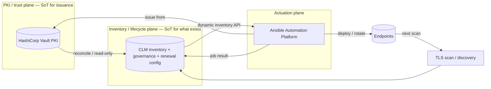
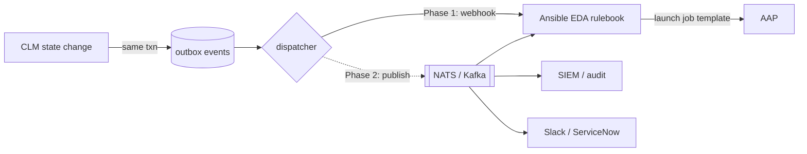

# ADR 0001 — Source of Truth and Event-Driven Automation

- **Status:** Accepted
- **Date:** 2026-07-06
- **Deciders:** David Joo
- **Context tags:** Mode C automation, Vault + AAP closed loop, HCP & TFE/self-managed

## Context

The Vault + AAP certificate-lifecycle closed loop needs a clear answer to two
questions:

1. **Where is the source of truth for the certificate inventory?** HCP Vault
   exposes a certificate dashboard, but it only knows certificates Vault issued,
   it does not exist on Terraform Enterprise / self-managed Vault, and it has no
   concept of *shadow* certificates found in the wild or of governance metadata
   (owner/team/environment/scope). We need one authoritative view that works
   uniformly across HCP **and** self-managed and that spans managed *and*
   unmanaged certificates.
2. **How do we trigger automation when the inventory changes** (a cert is
   discovered, crosses an expiry threshold, or is found revoked) without
   hard-wiring CLM to a single downstream consumer?

## Decision

### 1. Two planes of truth; CLM owns the inventory plane

Source of truth is split by concern:

- **Vault = system of record for issuance & trust** — the CA, private keys, PKI
  roles, and policies. Authoritative for "can I issue / revoke this." Key
  material never leaves Vault; CLM stores only the public certificate + metadata.
- **CLM = system of record for inventory & lifecycle state** — every certificate
  everywhere (managed *and* shadow), plus governance (owner/team/env/scope),
  expiry, revocation status, and **renewal configuration** (Vault PKI
  role/mount/service/target hosts). Authoritative for "what exists and what needs
  action."

CLM is the natural inventory source of truth because it is a strict superset of
any single dashboard:

| Knows about… | HCP Vault dashboard | CLM |
|---|---|---|
| Certs Vault issued | yes | yes (via reconcile) |
| Shadow / unmanaged certs found by scanning | no | yes |
| Governance (owner/team/env/scope) | no | yes |
| Renewal config (role/mount/service/target_hosts) | no | yes |
| Works on TFE / self-managed Vault | no | yes |

### 2. AAP builds dynamic inventory from a CLM REST endpoint

AAP consumes a **read-only CLM dynamic-inventory endpoint** (an AAP inventory
source pulls it) rather than querying Vault directly for expiry. The endpoint
returns eligible hosts + hostvars (CN, mount, role, service, target group) built
from the CLM inventory and the per-certificate `renewal_config` captured at
catalog/track time.

This is why `renewal_config` was added to the certificate model (migration
`000005`): it is the feed for AAP's dynamic inventory.

Guardrails:

- CLM stores public certs + metadata only — never key material.
- Freshness is the risk: schedule scans + reconcile so inventory does not drift;
  treat the Vault reconcile as truth for `managed_in_vault`.
- The inventory endpoint is read-only, paginated, and cacheable.

### 3. Event-driven automation via a transactional outbox, phased transport

CLM emits lifecycle events (`cert.discovered`, `cert.expiring`, `cert.revoked`,
`renewal.launched`, `renewal.completed`, `renewal.failed`, `blind_spot.detected`).

- **Transactional outbox:** when CLM changes state it writes an `events` row in
  the *same* database transaction. A dispatcher polls the outbox and delivers.
  This provides at-least-once delivery, retries, ordering, and an audit trail
  using the existing PostgreSQL — no new infrastructure required. The domain
  logic writes to the outbox; the transport is a swappable sink.
- **Phase 1 (transport):** deliver to **Red Hat Ansible EDA** via the
  `ansible.eda.webhook` source. EDA rulebooks decide which job template to launch
  from each event. This aligns with the existing AAP investment and needs no bus.
- **Phase 2 (transport):** when there are multiple consumers (SIEM, ticketing,
  other automation) or a need for durability/replay/fan-out, publish to a
  **message bus (NATS/JetStream or Kafka)**; EDA has native `kafka`/`aws_sqs`
  sources. Only the dispatcher's sink changes — the outbox and domain logic stay.

The event path is **complementary** to the explicit `POST /renew-expiring`
endpoint: the endpoint is the pull/batch trigger (operator or CI), the outbox +
EDA is the push/reactive trigger. Both call the **same internal "launch renewal"
service**, so there is one code path and two entry points.

## Consequences

- **Positive:** one uniform inventory across HCP and self-managed; shadow certs
  covered; governance drives targeting; the message-bus decision is deferred and
  reversible behind the outbox; reactive and batch automation share one launch
  path.
- **Negative / to manage:** CLM must be kept fresh (scan + reconcile cadence) or
  inventory drifts; the outbox dispatcher is another moving part to operate; a
  bus (Phase 2) adds infrastructure when introduced.
- **Explicitly rejected:** using the HCP Vault dashboard as the inventory source
  of truth (HCP-only, managed-certs-only, no governance); having AAP query Vault
  directly for expiry (misses shadow certs and renewal config); starting with a
  message bus on day one (premature infrastructure before a second consumer
  exists).

## Roadmap impact

1. `POST /renew-expiring` batch auto-renewal (Mode C PR 3b) — uses
   `renewal_config`.
2. Read-only **AAP dynamic-inventory endpoint** fed by `renewal_config`.
3. **Transactional outbox** + **Ansible EDA webhook** delivery (event Phase 1).
4. **Message bus** transport (event Phase 2) — when a second consumer appears.
