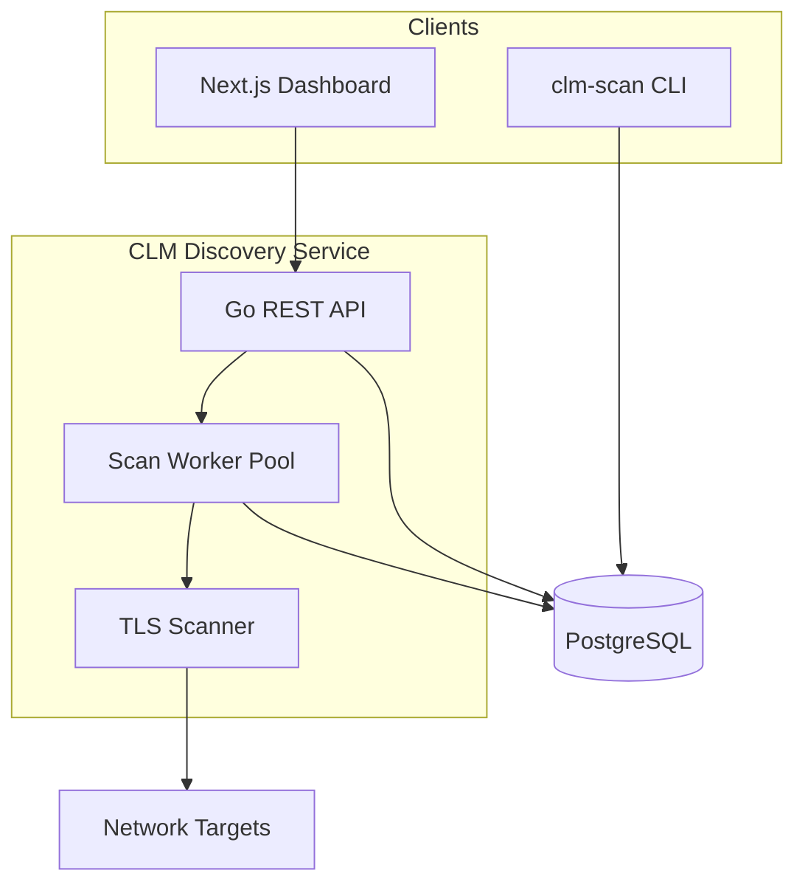

# Architecture

## Overview

Vault CLM Discovery is an **external service** that complements HashiCorp Vault PKI. It does not run as a Vault secrets-engine plugin. Instead, it:

1. Scans network targets for TLS certificates
2. Persists a normalized certificate inventory in PostgreSQL
3. Serves a REST API and Next.js dashboard
4. Reconciles discovered certs against Vault PKI mounts (Phase 1 read-only)

## Components

### TLS Scanner (`internal/scanner`)

- Expands CIDR ranges into IP:port targets
- Performs TCP connect + TLS handshake with `InsecureSkipVerify` to capture presented certificates
- Parses peer certificate chains via `crypto/x509`
- Blocks private ranges by default

### Certificate Parser (`internal/cert`)

- Extracts identity fields aligned with Vault PKI cert objects
- Computes `chain_status` and `hostname_matches_san`
- SHA-256 fingerprint as cross-scan dedup key

### Store (`internal/store`)

- PostgreSQL persistence with upsert-by-fingerprint
- Normalized observations table for `found_at[]` semantics
- Lifecycle fields computed on write
- Empty OCSP/CRL arrays stored as `{}` (not NULL) so upserts satisfy NOT NULL constraints
- `cert_scope` set on upsert via `governance.ClassifyScope` (chain status, issuer DN, hostname heuristics)

### API (`internal/api`)

- Chi HTTP router with CORS for dashboard
- Background scan worker with bounded concurrency
- Consent gate on scan creation
- `GET /api/v1/scans/{id}` — scan detail and diagnostics
- `GET /api/v1/scans/{id}/certificates` — certificates discovered in that scan
- `DELETE` on scans, certificates, and issuers (204 No Content) for demo reset
- `POST /api/v1/reconcile` — trigger Vault PKI reconcile (503 when `VAULT_ADDR` unset)
- `GET /api/v1/scans/{id}/blindspot` and `GET /api/v1/blindspot` — blind-spot counts
- Request ID propagated into structured logs and JSON error responses

### Governance classification (`internal/governance`)

At certificate upsert, `ClassifyScope` assigns `cert_scope`:

- `internal` — self-signed chains, internal hostname suffixes (`.local`, `.internal`, …), Vault/internal CA issuers, dev/staging environment
- `external` — public CA issuer hints (Let's Encrypt, DigiCert, …) or default until v1.1 Vault reconciliation overrides

### Scan worker flow

1. Expand hostnames/CIDRs into targets; record non-fatal expansion warnings
2. Probe each target concurrently; on success, upsert certificate (empty AIA arrays as `{}`)
3. Increment `certs_found` only after a successful certificate upsert (not on probe alone)
4. Track `targets_succeeded` / `targets_failed`, `upsert_failures`, and capped `failure_samples`
5. On completion, persist summary counts on the `scans` row
6. When `RECONCILE_ON_SCAN_COMPLETE=true`, run Vault PKI reconcile (errors logged, scan still succeeds)

### Observability

- JSON `slog` in `clm-discovery` and `clm-scan`; verbosity via `LOG_LEVEL`
- Scan worker logs include `scan_id`, target (`ip:port`), `hostname`, `sni`, and cert identifiers on upsert errors
- Persisted scan diagnostics on `scans`: `expansion_warnings`, probe/upsert aggregate counts, capped `failure_samples` JSON
- Scan completion emits a summary log line with targets succeeded/failed, certs found, and upsert failures

### Dashboard (`web/`)

- Next.js App Router UI aligned with **HashiCorp Vault’s Helios shell** (AppFrame: header, sidebar, main)
- Routes: certificate inventory (`/`), scans (`/scans`), scan detail (`/scans/[id]`), issuers (`/issuers`), certificate detail (`/certificates/[id]`)
- Inventory table: Vault, Imported, Scope, Expiry governance columns; delete actions on inventory, scans, and issuers
- Styling uses a subset of [Helios design tokens](https://helios.hashicorp.design/foundations/colors); header logo is Flight Icons `vault-color-24` (same glyph as Vault UI)
- Server components call the Go API via `web/lib/api.ts` (`API_INTERNAL_URL` in Docker, `NEXT_PUBLIC_API_URL` in browser)

See [docs/superpowers/specs/2026-06-14-vault-ui-design.md](superpowers/specs/2026-06-14-vault-ui-design.md) for UI design rationale and file map.

## Deployment

Recommended: Docker Compose or Kubernetes Deployment alongside Vault infrastructure.

The service needs outbound network access to scan targets and inbound access to its API from the dashboard. It does not require co-location with Vault for v1.

## Vault integration (Phase 1)

`internal/vault` provides a read-only PKI client and reconciler:

- Authenticate via token (AppRole/AWS deferred)
- List PKI mounts, serials, and stored certificates
- Match by `fingerprint_sha256` to set `managed_status`, `vault_pki_mount`, `vault_issuer_ref`, `serial_number`
- `POST /api/v1/reconcile` or optional post-scan hook (`RECONCILE_ON_SCAN_COMPLETE`)

HCP Vault Dedicated uses the same HTTP API with namespace headers.

Future: CA bundle import via `pki/issuers/import/bundle`, AppRole/K8s auth.

## Security considerations

- Scan consent required at API and CLI
- Private range scanning disabled by default
- Maximum IPv4 scan size: /16
- Store PEM material in PostgreSQL — protect database access accordingly
- Use read-only Vault policies for reconciliation; separate policy for CA import
