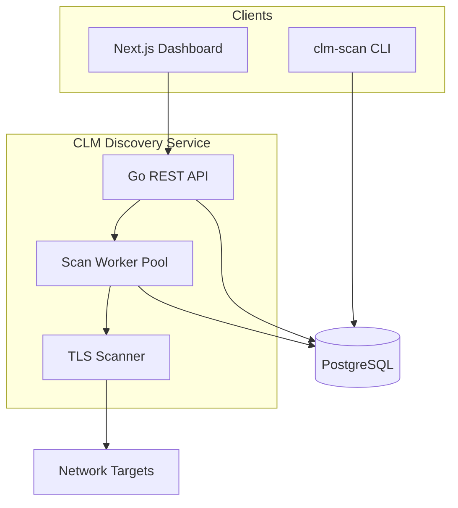

# Architecture

## Overview

Vault CLM Discovery is an **external service** that complements HashiCorp Vault PKI. It does not run as a Vault secrets-engine plugin. Instead, it:

1. Scans network targets for TLS certificates
2. Persists a normalized certificate inventory in PostgreSQL
3. Serves a REST API and Next.js dashboard
4. Reconciles discovered certs against Vault PKI mounts (Phase 1 read-only)

```mermaid
flowchart TB
  subgraph clients [Clients]
    Dashboard[Next.js Dashboard]
    CLI[clm-scan CLI]
  end

  subgraph service [CLM Discovery Service]
    API[Go REST API]
    Worker[Scan Worker Pool]
    Scanner[TLS Scanner]
  end

  DB[(PostgreSQL)]
  Network[Network Targets]

  Dashboard --> API
  CLI --> DB
  API --> Worker
  Worker --> Scanner
  Scanner --> Network
  Worker --> DB
  API --> DB
```

## Components

### TLS Scanner (`internal/scanner`)

- Expands CIDR ranges into IP:port targets
- Performs TCP connect + TLS handshake with `InsecureSkipVerify` to capture presented certificates
- Parses peer certificate chains via `crypto/x509`
- Blocks private ranges by default

### Certificate Parser (`internal/cert`)

- Extracts identity fields aligned with Vault PKI cert objects
- Computes `chain_status` and `hostname_matches_san`
- SHA-256 fingerprint as cross-scan dedup key

### Store (`internal/store`)

- PostgreSQL persistence with upsert-by-fingerprint
- Normalized observations table for `found_at[]` semantics
- Lifecycle fields computed on write
- Empty OCSP/CRL arrays stored as `{}` (not NULL) so upserts satisfy NOT NULL constraints
- `cert_scope` set on upsert via `governance.ClassifyScope` (chain status, issuer DN, hostname heuristics)

### API (`internal/api`)

- Chi HTTP router with CORS for dashboard
- **Default-deny AuthN** except `GET /api/v1/health`. `CLM_AUTH_MODE=static_token` maps Bearer tokens (`CLM_STATIC_TOKENS`) to RBAC roles. `CLM_INSECURE_NO_AUTH=true` is a UAT/integration hatch (caller treated as `platform_admin`)
- RBAC: `viewer` (GET), `scanner_operator` (+ scans), `remediator` (+ catalog/renew/PATCH/revoke), `vault_import_admin` (+ CA import/reconcile), `approver` (stub), `platform_admin` (DELETE + Settings mutate), `inventory` (`GET /inventory` only — AAP, not a dashboard page)
- Consent is **intent after RBAC**: unauthorized + `consent:true` → 401/403; authorized + `consent:false` → 400
- Append-only `audit_events` on privileged mutations and 401/403 (not the EDA `events` outbox)
- Background scan worker with bounded concurrency
- Consent gate on scan creation
- `GET /api/v1/scans/{id}` — scan detail and diagnostics
- `GET /api/v1/scans/{id}/certificates` — certificates discovered in that scan
- `DELETE` on scans, certificates, and issuers (204 No Content) for demo reset — `platform_admin` only
- `POST /api/v1/reconcile` — trigger Vault PKI reconcile (503 when `VAULT_ADDR` unset); response includes a `status` of `ok`/`partial`/`failed` alongside `errors`
- `GET /api/v1/scans/{id}/blindspot` and `GET /api/v1/blindspot` — blind-spot counts
- Connections Settings: `GET|PUT|PATCH /api/v1/settings/connections` and `POST /api/v1/settings/connections/test` (see below)
- Request ID propagated into structured logs, audit rows, and JSON error responses

### Governance classification (`internal/governance`)

At certificate upsert, `ClassifyScope` assigns `cert_scope`:

- `internal` — self-signed chains, internal hostname suffixes (`.local`, `.internal`, …), Vault/internal CA issuers, dev/staging environment
- `external` — public CA issuer hints (Let's Encrypt, DigiCert, …) or default until v1.1 Vault reconciliation overrides

### Scan worker flow

1. Expand hostnames/CIDRs into targets; record non-fatal expansion warnings
2. Probe each target concurrently; on success, upsert certificate (empty AIA arrays as `{}`)
3. Increment `certs_found` only after a successful certificate upsert (not on probe alone)
4. Track `targets_succeeded` / `targets_failed`, `upsert_failures`, and capped `failure_samples`
5. On completion, persist summary counts on the `scans` row
6. When `RECONCILE_ON_SCAN_COMPLETE=true`, run Vault PKI reconcile (errors logged, scan still succeeds; the reconcile is bounded by a timeout so an unresponsive Vault cannot block subsequent scans)

### Observability

- JSON `slog` in `clm-discovery` and `clm-scan`; verbosity via `LOG_LEVEL`
- Scan worker logs include `scan_id`, target (`ip:port`), `hostname`, `sni`, and cert identifiers on upsert errors
- Persisted scan diagnostics on `scans`: `expansion_warnings`, probe/upsert aggregate counts, capped `failure_samples` JSON
- Scan completion emits a summary log line with targets succeeded/failed, certs found, and upsert failures

### Testing tiers

- **Unit** — `go test ./...`. Default tier; runs on every build, no external
  services.
- **Build-tagged integration** — `go test -tags uat ./internal/uat/...`.
  Excluded from the default `go test ./...` (via `//go:build uat`); exercises
  the real scanner → parser → governance → compliance pipeline against
  in-process `httptest`-served TLS certificates. Runs in CI as a separate
  step.
- **Docker-compose UAT** (`test/uat/`) — real HTTPS endpoints (nginx
  containers) behind the real API and Postgres, driven by a host-side script.
  Manual/demo tier, not run in CI. Default profile covers a self-signed
  expiry/validity cert matrix; opt-in `--profile vault` and
  `--profile letsencrypt` validate reachable-Vault shadow classification and
  a real Let's Encrypt staging certificate, respectively.

See [test/uat/README.md](../test/uat/README.md) for how to run each UAT tier,
the expected-results matrix, and intended (sometimes counter-intuitive)
behaviors to check before treating a failure as a bug. Design rationale:
[docs/superpowers/specs/2026-07-02-uat-expiry-compliance-testing-design.md](superpowers/specs/2026-07-02-uat-expiry-compliance-testing-design.md).

### Dashboard (`web/`)

- Next.js App Router UI aligned with **HashiCorp Vault’s Helios shell** (AppFrame: header, sidebar, main)
- Routes: certificate inventory (`/`), scans (`/scans`), scan detail (`/scans/[id]`), issuers (`/issuers`), certificate detail (`/certificates/[id]`), Connections (`/settings/connections`)
- Inventory table: Vault, Imported, Scope, Expiry governance columns; delete actions on inventory, scans, and issuers
- Styling uses a subset of [Helios design tokens](https://helios.hashicorp.design/foundations/colors); header logo is Flight Icons `vault-color-24` (same glyph as Vault UI)
- Connections page uses the same Helios CSS (`panel`, form fields, badges) — not shadcn/ui
- Server components call the Go API via `web/lib/api.ts` (`API_INTERNAL_URL` + `CLM_API_TOKEN`). Browser traffic uses the same-origin BFF (`web/app/api/v1/[...path]` and Settings `web/app/api/settings/connections`) which attaches server-only Authorization. No `NEXT_PUBLIC_*` tokens. AAP `GET /inventory` is not proxied and is not a dashboard page. Delete buttons remain; they succeed only when the BFF token is `platform_admin`

See [docs/superpowers/specs/2026-06-14-vault-ui-design.md](superpowers/specs/2026-06-14-vault-ui-design.md) for UI design rationale and file map.

## Deployment

Recommended: Docker Compose or Kubernetes Deployment alongside Vault infrastructure.

The service needs outbound network access to scan targets and inbound access to its API from the dashboard. It does not require co-location with Vault for v1.

## Vault integration (Phase 1)

`internal/vault` provides a read-only PKI client and reconciler:

- Authenticate via token or AppRole (login + client-token cache/renew in `internal/vault`). AWS/K8s deferred
- **Split identities:** read/reconcile uses `VAULT_TOKEN` or `VAULT_ROLE_ID`/`VAULT_SECRET_ID`; CA import requires `VAULT_IMPORT_TOKEN` or import AppRole. Import with only the read identity configured returns **503**
- List PKI mounts, serials (via Vault's `LIST` cert operation), and stored certificates
- Match by `fingerprint_sha256` to set `managed_status`, `vault_pki_mount`, `vault_issuer_ref`, `serial_number`
- All Vault HTTP calls use a bounded client timeout
- `POST /api/v1/reconcile` or optional post-scan hook (`RECONCILE_ON_SCAN_COMPLETE`); reconcile summary carries a `status` (`ok`/`partial`/`failed`)
- Process-start reconcile/import still bind `VAULT_*` / `VAULT_IMPORT_*` env from `config.Load()` (see Connections resolve)

HCP Vault Dedicated uses the same HTTP API with namespace headers. Settings UX (`hcp_dedicated` vs `self_managed`) is labels + `namespace=admin` preset only.

Future: Kubernetes/AWS auth. CA import uses `pki/issuers/import/bundle`.

## Connections settings

Operators configure Vault, AAP Controller, and the EDA webhook from **Settings → Connections** (`/settings/connections`). Compose env remains the 12-factor default; a UI save overlays that target. The UI uses human labels (**Deployment**, **Renew with**, **Template name**, **Default Vault PKI mount**); env names (`AAP_DEFAULT_MOUNT`, etc.) are unchanged.

**Default Vault PKI mount** (`default_mount` / `AAP_DEFAULT_MOUNT`) is the Vault PKI path passed to Mode C renewals when the cert/request has no mount — not an AAP resource id.

Dropdowns for PKI mounts and AAP job/workflow template **names** load from read-only options endpoints (resolved connection). Empty list or peer failure → free-text input. Options never return secrets and never launch jobs.

### Resolve order (`internal/settings`)

1. **Env default** — no `connections` row, or `source=env`: live values come from `VAULT_*` / `AAP_*` / `EDA_*`.
2. **UI overlay** — PUT/PATCH upserts the row, encrypts secrets under `CLM_CONNECTIONS_KEY`, sets `source=db`. Metadata and non-empty decrypted secrets overlay env for that target; missing secret keys fall back to env.
3. **Write-only secrets** — omitted or empty secret fields keep the stored value. JSON `null` clears a secret so the target can fall back to env.
4. **Missing `CLM_CONNECTIONS_KEY`** — env-only mode still works. PUT/PATCH that would persist new secrets → **503**. Plaintext secrets are never stored.

`settings.Resolve` is used by GET (masked `PublicView`), Test, and options. Reconcile, Mode C renew, and the EDA dispatcher still bind process env at startup and do **not** hot-reload from a UI save.

### API

All under `/api/v1/settings/connections`. The Next BFF proxies with `Authorization`.

| Method | Behavior |
|--------|----------|
| `GET` | Masked view: `configured`, `source`, metadata, `*_set` flags. Never token / `role_id` / `secret_id` values. |
| `PUT` | Replace all three targets (`vault`, `aap`, `eda` required). Invalid `deployment` / `auth_method` → 400. |
| `PATCH` | Partial update (one or more targets). Same write-only secret rule. |
| `POST /test` | Body `{"target":"vault"|"aap"|"eda"}` only. Uses **resolved** credentials on the server. Never accept a secret in the test body. |
| `GET /options/vault-pki-mounts` | `{items}` PKI mount paths via `ListPKIMounts`. Unconfigured → empty; configured but list fails → **502**. |
| `GET /options/aap-templates?kind=job\|workflow` | `{kind, items:[{id,name}]}` for selects (Settings stores **name** + `renew_workflow`). Unconfigured → empty; peer fail → **502**; bad `kind` → **400**. Never launches jobs. |

Auth: unauthenticated GET/PUT/PATCH/Test/options → **401**. `CLM_INSECURE_NO_AUTH=true` (UAT/integration) treats the caller as `platform_admin`. With a static token: `platform_admin` can read and mutate; `remediator` GET/options 200 (still no secrets), PUT/Test 403; other roles 403. 401/403 from the auth middleware write `audit_events`.

### Test probes

Server-side only. Credentials come from `settings.Resolve` (DB overlay else env).

| Target | Probe | Must not |
|--------|--------|----------|
| **Vault** | `GET /v1/sys/mounts` via `vault.Client.ListMounts` (token: `X-Vault-Token`; AppRole: login then the same call with the cached client token). Success detail `sys/mounts 200` (+ `namespace=` when set). | Persist the AppRole-derived token in the `connections` row (cache lives on the Vault client). |
| **AAP** | `GET /api/v2/me` then resolve `AAP_RENEW_TEMPLATE` by name (`FindJobTemplate` or `FindWorkflowJobTemplate` when `renew_workflow`). | **Launch a job.** No `POST .../launch`. |
| **EDA** | `eventbus.Ping`: `POST` the webhook URL with the same auth as the dispatcher (`Authorization: Bearer` when token set) and body `{"event_type":"clm.connection.test","id":"<uuid>","created_at":"<rfc3339>"}`. Success = **2xx**. | Write the `events` outbox or start the dispatcher. No NATS/Kafka. |

HCP vs self-managed does not change probes.

## Security considerations

- API is default-deny except health. Dashboard BFF attaches `CLM_API_TOKEN`; never `NEXT_PUBLIC_*` tokens
- Scan consent required at API and CLI — **consent is not authorization** (RBAC first, then consent)
- Private range scanning disabled by default
- Maximum IPv4 scan size: /16
- Store PEM material in PostgreSQL — protect database access accordingly
- Use read-only Vault policies for reconciliation; separate import identity (`VAULT_IMPORT_*`) for CA import
- Connection secrets are AES-256-GCM in `connections.secrets_enc` under `CLM_CONNECTIONS_KEY`; GET never echoes them; Test details redact known secret substrings
- `CLM_INSECURE_NO_AUTH` is UAT/integration-only and applies API-wide, not Settings-only
- Privileged mutations and 401/403 are recorded in `audit_events` (no tokens, PEM, or AAP secrets in `payload`)

### Residual risk: dashboard BFF

M1 default-deny applies to the **Go API** (`:8080`). The Next.js BFF (`web/app/api/v1/[...path]/route.ts`) holds ambient `CLM_API_TOKEN` authority (demo compose: `platform_admin`) until OIDC/session lands. Anyone who can reach the Next origin can perform the API mutations M1 closed on `:8080`. Do **not** treat the control plane as closed to unauthenticated mutation at the deployment edge. Follow-up: [authenticate the dashboard BFF (OIDC/session)](https://github.com/glimpsovstar/hashicorp-vault-clm-discovery/issues/89).
