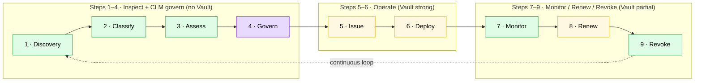
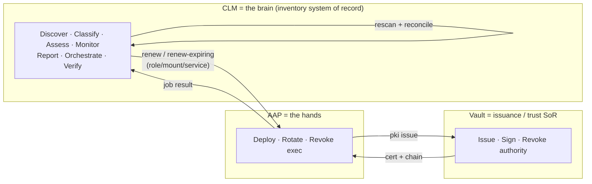

# CLM coverage map — the 9-step lifecycle vs. what this tool addresses

This maps the **9-step CLM lifecycle defined in the research briefing** onto what
**CLM-discovery** does today, and where **Vault** and **AAP** execute the
lifecycle mutations. It complements [ADR 0001](adr/0001-source-of-truth-and-event-driven-automation.md)
(source of truth + event architecture) and the deeper `progress.md`.

> Source of the 9 steps: the research briefing's lifecycle line / ring model
> (`CLM-discovery-research/html-doc/.../index.html`). The grouping (1–4 / 5–6 /
> 7–9) and the Vault coverage (none → strong → partial) are taken directly from
> that briefing. The research also has a 3-ring headline model
> (**Inspect · Protect · Govern**), an outer "ongoing envelope" (steps 10–13:
> change traceability, status & history, report & act, import & replace), and a
> 19-item capability model in
> [02-clm-reference §2.3](../../CLM-discovery-research/doc/02-clm-reference.md).

## The 9 steps and coverage

Legend: **green** = CLM-discovery does it · **yellow** = CLM orchestrates,
Vault/AAP execute · **purple** = partial / planned.

## Who owns each step (the closed loop)

## Coverage detail

| # | Step (research) | Group | Vault (per research) | CLM-discovery status | Executes |
|---|-----------------|-------|----------------------|----------------------|----------|
| 1 | Discovery | Inspect | none | Done — TLS scan (CIDR + hostname/SNI), shadow-cert discovery | CLM |
| 2 | Classify | Inspect | none | Done — internal/external scope, chain status | CLM |
| 3 | Assess | Inspect | none | Done — SC-081/PCI/crypto evaluators, expiry risk, blind-spot | CLM |
| 4 | Govern | CLM govern | roles scope issuance only | Partial — governance tags (owner/team/env); full policy engine is Release 2 (not built) | CLM |
| 5 | Issue | Operate | strong | Orchestrated — CLM launches AAP → Vault PKI issues | Vault |
| 6 | Deploy | Operate | strong (Agent) | Orchestrated — CLM launches AAP (`wf_deploy` nginx/tomcat) | AAP |
| 7 | Monitor | Monitor/renew/revoke | partial | Done — rescan, expiry, drift/reconcile, revocation (OCSP/CRL/stapled), blind-spot | CLM |
| 8 | Renew | Monitor/renew/revoke | partial | On-demand done (`POST /renew`); auto planned (`POST /renew-expiring`) | CLM → AAP → Vault |
| 9 | Revoke | Monitor/renew/revoke | partial | Detect + record verified (durable); revoke action planned (`clm_revoke`) | CLM detect / AAP+Vault act |

**Read of it (matches the research's framing):** Vault is strong at **5–6**,
partial at **7–9**, and absent at **1–4**. CLM-discovery fills exactly the gaps
the research calls out — it *owns* the Inspect steps (1–3), adds estate-wide
**Monitor** (7) and verified **Revoke** detection (9), provides **Govern**
metadata (4, policy engine deferred to Release 2), and *orchestrates*
Issue/Deploy/Renew (5, 6, 8) across shadow and external certs that Vault alone
cannot reach. Remaining gaps are planned and sequenced: auto-renew
(`/renew-expiring`), the revoke action, and the evidence/event outbox (ADR 0001).
