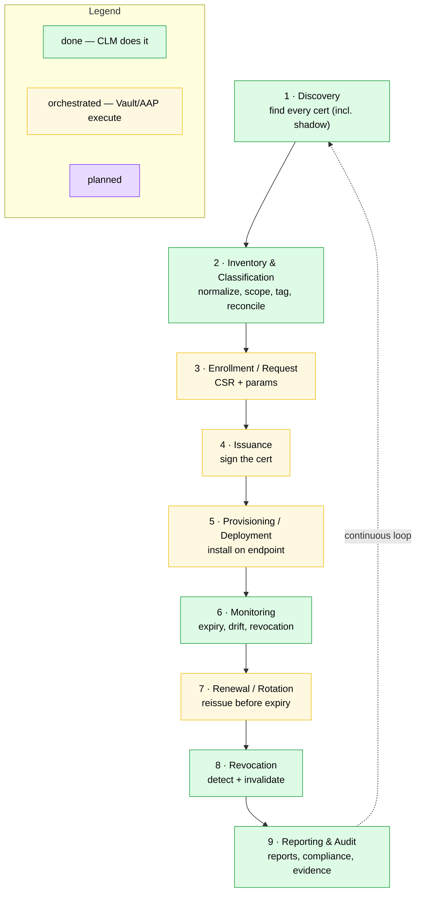
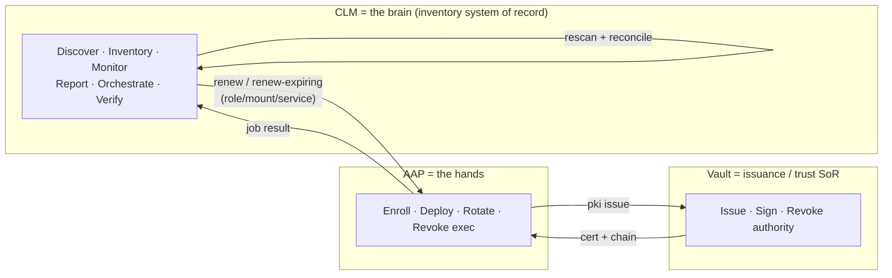

# CLM coverage map — the 9-step lifecycle vs. what this tool addresses

This maps the standard 9-step certificate-lifecycle-management (CLM) model onto
what **CLM-discovery** does today, and where **Vault** and **AAP** execute the
lifecycle mutations. It complements [ADR 0001](adr/0001-source-of-truth-and-event-driven-automation.md)
(source of truth + event architecture) and the deeper `progress.md`.

> Model note: the research report uses a 19-item capability model
> ([02-clm-reference §2.3](../../CLM-discovery-research/doc/02-clm-reference.md))
> and the solution deck uses a 7-stage operational model. This page uses the
> common **industry 9-step lifecycle** for an at-a-glance comparison.

## The 9 steps and coverage

## Who owns each step (the closed loop)

## Coverage detail

| # | CLM 9-step | Status | Who executes | CLM feature |
|---|-----------|--------|--------------|-------------|
| 1 | Discovery | Done | CLM | TLS scan (CIDR + hostname/SNI), shadow-cert discovery |
| 2 | Inventory & Classification | Done | CLM | Normalized inventory, internal/external scope, owner/team/env tags, Vault reconcile |
| 3 | Enrollment / Request | Orchestrated | AAP -> Vault | `renew` maps CN/mount/role -> AAP issue role |
| 4 | Issuance | Orchestrated | Vault PKI | AAP launched by CLM issues from Vault |
| 5 | Provisioning / Deployment | Orchestrated | AAP | `wf_deploy` (nginx/tomcat); CLM triggers |
| 6 | Monitoring | Done | CLM | Rescan, expiry, drift/reconcile, revocation (OCSP/CRL/stapled), blind-spot |
| 7 | Renewal / Rotation | On-demand done / auto planned | CLM -> AAP -> Vault | `POST /renew` done; `POST /renew-expiring` next |
| 8 | Revocation | Detect done / act planned | CLM detect, AAP exec | Verified revoke recorded + durable; `clm_revoke` action planned |
| 9 | Reporting & Audit | Report done / evidence planned | CLM | Scan report (MD/CSV/JSON), compliance summary; event outbox (ADR Phase 1) |

**Summary:** CLM fully owns the *sense + understand + report* half of the
lifecycle (steps 1, 2, 6, 8, 9) and *orchestrates* the *operate* half (3–5, 7)
through Vault + AAP. The remaining gaps are planned and sequenced: auto-renew
(`/renew-expiring`), the revoke action, and the evidence/event outbox.
