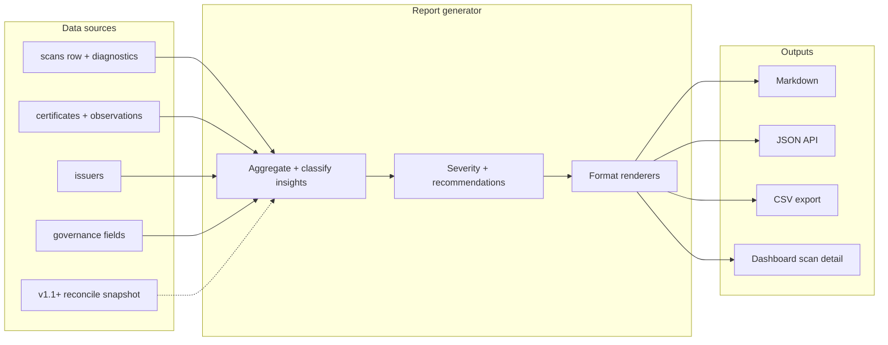

# Reporting architecture — environment scan reports

Ongoing reference for **certificate-focused environment scan reports** in Vault CLM Discovery. Complements the dashboard and REST API; does not replace them.

**Related:** [CLM lifecycle — Discover phase](superpowers/specs/2026-06-14-clm-lifecycle-workflow-design.md#phase-1-discover), [scan report + import design spec](superpowers/specs/2026-06-14-scan-report-and-vault-import-design.md), [data model](data-model.md), [architecture](architecture.md) § Observability ([#14](https://github.com/glimpsovstar/hashicorp-vault-clm-discovery/issues/14)).

## Purpose

After a TLS scan completes, operators need a **shareable, Radar-style artifact** that summarizes what was found on the wire — certificate health, expiry risk, issuer trust, and scope — without implying a full Vault security posture review.

This document defines the **report pipeline**, data sources, output formats, section template, and non-goals. Implementation is planned for **v1.2** (see design spec).

## Vault Radar pattern (adapted for CLM)

Research target: [`hashicorp/vault-scanning-and-insights-cli`](https://github.com/hashicorp/vault-scanning-and-insights-cli) (Vault Radar CLI).

| Radar concept | Radar behavior | CLM adaptation |
|---------------|----------------|----------------|
| **Insight / risk** | Atomic finding: `category`, `type`, `description`, `severity`, `fingerprint`, location (`path`, `deep_link`), `activeness`, `tags`, `metadata` | **Cert insight**: one row per cert, issuer, or scan-level diagnostic — not secrets/PII |
| **Severity** | `info` → `critical` (proto enum) | Map cert lifecycle + chain + governance to severity (see § Insight severity) |
| **Scan summary** | CLI TUI: targets scanned, new vs baseline risks | Scan run header: targets, certs persisted, probe/upsert failures |
| **Output formats** | CSV (default), JSON (JSONL risks), SARIF 2.1.0 | Markdown (primary), JSON (API), CSV (export), optional SARIF-like JSON for CI |
| **Delivery** | Local `--outfile`; HCP upload for portal | API `GET …/report`, dashboard “Download report”, optional `clm-scan report` |
| **Baseline / delta** | `--baseline` file; only new risks | Compare to prior scan or inventory snapshot (v1.3) |

Radar scans **code and config for secrets**. CLM reports **TLS deployment inventory only** — no secret detection, no Vault policy audit, no HCP Radar integration.

## Report pipeline



### Trigger points

| Trigger | Version | Notes |
|---------|---------|-------|
| Scan `status=completed` | v1.2 | Async job or on-demand generation; store report snapshot keyed by `scan_id` |
| Manual refresh | v1.2 | Regenerate from current DB state (inventory may have changed since scan) |
| Scheduled / drift | v1.3 | Diff report vs previous scan |

### Generator responsibilities

1. **Scope** — Only certs with `certificate_observations.scan_id = {id}` (plus issuers referenced by those chains).
2. **Aggregate** — Counts by `status`, `cert_scope`, `managed_status`, `chain_status`, issuer DN, key type.
3. **Classify insights** — Derive recommendation codes (import CA, reconcile, monitor external, fix SAN mismatch).
4. **Render** — Pure functions per output format; no PEM in Markdown by default.

## Data sources

### Scan run (`scans`)

From [data model — Scan run metadata](data-model.md#scan-run-metadata-scans) and [#14](https://github.com/glimpsovstar/hashicorp-vault-clm-discovery/issues/14) diagnostics:

| Field | Report use |
|-------|------------|
| `id`, `created_at`, `completed_at` | Report header, generation timestamp |
| `cidrs`, `hostnames`, `ports` | Scope description |
| `targets_total`, `targets_succeeded`, `targets_failed` | Coverage metrics |
| `certs_found`, `upsert_failures` | Discovery success rate |
| `expansion_warnings`, `failure_samples` | Operational insights (probe errors, not cert risks) |
| `status`, `error` | Report validity banner |

### Certificates (`certificates` + `certificate_observations`)

| Field group | Report use |
|-------------|------------|
| Identity (`subject_cn`, `subject_alt_names`, `fingerprint_sha256`, `issuer_dn`) | Insight rows, dedup |
| Lifecycle (`status`, `days_until_expiry`, `not_after`) | Expiry risk section |
| Discovery (`hostname_matches_san`, `chain_status`, observations) | Misconfiguration + where-seen |
| Governance (`cert_scope`, `managed_status`, `vault_pki_mount`) | Scope breakdown, Vault linkage |
| Crypto (`key_type`, `key_bits`, `signature_algorithm`) | Weak crypto insights (future) |

### Issuers (`issuers`)

| Field | Report use |
|-------|------------|
| `issuer_dn`, `is_ca`, `ca_chain` | Issuer trust section |
| `managed_status`, `vault_issuer_ref` | Import/reconcile recommendations |

### Optional: Vault reconcile (v1.1+)

Post-scan reconcile enriches `managed_status` before report generation. Report should label reconcile timestamp if run between scan complete and report build.

## Insight model (CLM “risks”)

Analogous to Radar `Risk` ([`scan.proto`](https://github.com/hashicorp/vault-scanning-and-insights-cli/blob/main/proto/scan/v1/scan.proto)):

```json
{
  "category": "certificate",
  "type": "expiring_soon",
  "description": "Certificate expires within 30 days",
  "severity": "medium",
  "fingerprint_sha256": "…",
  "subject_cn": "api.example.com",
  "observations": [{ "ip": "10.0.0.1", "port": 443, "hostname": "api.example.com" }],
  "recommendation": "plan_renewal",
  "tags": ["external", "unmanaged"],
  "metadata": { "days_until_expiry": 12, "issuer_dn": "…" }
}
```

### Insight categories (cert-only)

| Category | Examples |
|----------|----------|
| `certificate` | expiry, expired, weak key, SAN mismatch |
| `issuer` | unknown CA, incomplete chain, self-signed internal |
| `governance` | unmanaged shadow cert, scope mismatch |
| `scan` | high probe failure rate, expansion warnings (operational) |

### Insight severity mapping

| Condition | Severity |
|-----------|----------|
| `status=expired` on production-facing observation | `high` |
| `status=expiring_soon` (≤30d) | `medium` |
| `chain_status=incomplete` or `untrusted_root` | `medium` |
| `hostname_matches_san=false` | `low` |
| `managed_status=unmanaged` + `cert_scope=internal` | `low` (governance) |
| Informational counts (key algorithm distribution) | `info` |

### Recommendation codes

| Code | Meaning |
|------|---------|
| `monitor_external` | Public CA leaf; CLM-only tracking |
| `reconcile_vault` | Likely Vault-issued; run PKI reconcile |
| `import_ca` | Issuer not in Vault; `pki/issuers/import/bundle` |
| `catalog_import` | Mark tracked in CLM without Vault write |
| `fix_san` | Hostname/SNI does not match SAN |
| `rescan` | Incomplete chain; import intermediate then rescan |

## Section template (Radar-style)

Reports follow a fixed section order for operator familiarity and demo narrative.

### 1. Executive summary

- Scan ID, time range, target summary (hostnames/CIDRs/ports)
- Headline counts: unique certs, observations, issuers, insights by severity
- Top 3 recommendations (narrative bullets)
- Link to dashboard scan detail and inventory filtered by scan

### 2. Scan coverage & diagnostics

- Targets succeeded / failed / total
- Certs persisted vs upsert failures
- Expansion warnings (verbatim, capped)
- Failure samples table (`kind`, `reason`, target) — mirrors [#14](https://github.com/glimpsovstar/hashicorp-vault-clm-discovery/issues/14) API fields

### 3. Certificate health

- Breakdown by `status`: valid, expiring_soon, expired
- Histogram or table: days until expiry buckets
- List **high/medium** expiry insights with CN, fingerprint prefix, observation endpoints

### 4. Expiry risk

- Certs expiring in 7 / 30 / 90 days
- Cross-tab: expiry × `cert_scope` (internal vs external)
- Optional: owner/team if governance PATCH populated

### 5. Issuer trust & chain quality

- Issuer inventory: CA vs leaf, public vs private heuristics
- `chain_status` distribution: complete, incomplete, self_signed, untrusted_root
- Issuers not present in Vault PKI (v1.1+: compare reconcile)
- Recommended CA import candidates

### 6. Scope & governance breakdown

- `cert_scope`: internal / external counts
- `managed_status`: unmanaged, managed_in_vault, imported
- Shadow cert narrative: on wire but not in Vault
- Vault-managed but not seen (if reconcile run — optional subsection)

### 7. Recommendations

Prioritized action list grouped by lifecycle phase:

| Phase | Example actions |
|-------|-----------------|
| Discover | Rescan after CA import; fix probe failures |
| Choose | Review scope overrides for public SAN on internal CA |
| Import | Import intermediate for issuer X |
| Manage | Reconcile; set owner tags; plan renewal |

### 8. Appendix

- Full cert table (CSV attachment or linked export)
- Methodology: TLS probe, dedup key, consent policy
- Non-goals reminder (below)

## Output formats

| Format | Primary consumer | v1.2 | Notes |
|--------|------------------|------|-------|
| **Markdown** | Humans, PR comments, demo | Yes | Default download; Helios-styled HTML render in dashboard (optional) |
| **JSON** | API, automation | Yes | Structured report document; insights array |
| **CSV** | Spreadsheets, SIEM | Yes | Flattened insights + optional cert inventory sheet |
| **SARIF-like JSON** | CI gates | Defer v1.3 | Map insights to SARIF `results` if GitHub/GitLab integration needed |
| **PDF** | Compliance archive | Defer | Generate from Markdown via external tool |

### Proposed API (v1.2)

```
GET /api/v1/scans/{id}/report?format=markdown|json|csv
```

- `404` if scan not completed
- `202` if report generation in progress (async option)
- Include `generated_at`, `scan_id`, `report_version`

### CLI (v1.2, optional)

```
clm-scan report --scan-id <uuid> --format markdown -o report.md
```

## Storage

| Approach | Trade-off |
|----------|-----------|
| **On-demand** (query DB each request) | Simple; always fresh; slower for large scans |
| **Snapshot** (`scan_reports` table or object store) | Fast download; stale if inventory edited |

**Recommendation:** On-demand for v1.2 demo scale; add snapshot + cache when scans exceed ~500 certs.

## Non-goals

- Full Vault security posture (policies, auth methods, seal status)
- Secret / PII scanning (Vault Radar scope)
- Pushing report rows into HCP Certificates Inventory
- Automatic CA import or cert issuance from report
- PDF generation in v1.2
- Replacing dashboard as primary operator UI

## Version phasing

| Version | Reporting capability |
|---------|---------------------|
| **v1** | Scan detail API + diagnostics ([#14](https://github.com/glimpsovstar/hashicorp-vault-clm-discovery/issues/14)); inventory UI |
| **v1.1** | Reconcile enriches governance sections |
| **v1.2** | Report generator, Markdown/JSON/CSV, dashboard download |
| **v1.3** | Baseline/delta reports, SARIF export, scheduled drift summary |

## References

- [Vault Radar CLI](https://github.com/hashicorp/vault-scanning-and-insights-cli) — CSV/JSON/SARIF writers, risk proto, scan summary UI
- [HCP Vault Radar overview](https://developer.hashicorp.com/hcp/docs/vault-radar) — product framing for “insights”
- [CLM scan report + import design](superpowers/specs/2026-06-14-scan-report-and-vault-import-design.md)
- [CLM lifecycle workflow](superpowers/specs/2026-06-14-clm-lifecycle-workflow-design.md)
