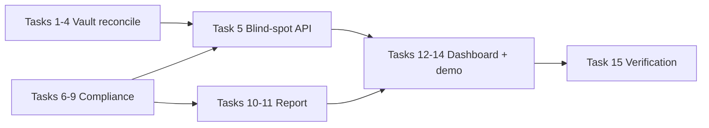

# Phase 1 — Blind-spot reveal demo Implementation Plan

> **For agentic workers:** REQUIRED SUB-SKILL: Use superpowers:subagent-driven-development (recommended) or superpowers:executing-plans to implement this plan task-by-task. Steps use checkbox (`- [ ]`) syntax for tracking.

**Goal:** Deliver the Release 1 POV demo — *"Vault sees N. We found M. Here are K SC-081 violations"* — by shipping Vault PKI reconcile, compliance rule packs, blind-spot dashboard, and scan report v0.

**Architecture:** Extend the existing Go service with `internal/vault` (read-only PKI client), `internal/compliance` (SC-081/PCI/crypto evaluators), and `internal/report` (Markdown/JSON renderers). Dashboard adds blind-spot card and reconcile action. Findings computed on read in Phase 1; persistence deferred to Phase 2.

**Tech Stack:** Go 1.22+, PostgreSQL, Vault HTTP API, Chi REST, Next.js 14 (App Router), table-driven Go tests, httptest Vault mocks.

**Research alignment:** [CLM-discovery-research Release 1 §9.0](https://github.com/glimpsovstar/CLM-discovery-research/blob/main/doc/03-vault-gap-and-plugin.md#90-release-1-commitment-vs-product-vision)

**Timeline:** 0–6 weeks (Phase 1 gate before Phase 2 collectors)

---

## Business benefits

| Stakeholder | Benefit |
|-------------|---------|
| **Field / pre-sales** | Ten-second POV demo that proves Vault's blind spot on a live hybrid estate — opens CLM conversations without Venafi rip-and-replace positioning |
| **CISO / risk** | First audit-ready SC-081 and PCI inventory gap report from network truth, not Vault-issued telemetry alone |
| **Platform / PKI team** | Single inventory correlating wire deployment with Vault PKI; prioritises shadow cert remediation backlog |
| **Audit / compliance** | Findings in regulatory language (SC-081 validity, weak crypto, missing owner) exportable as Markdown report |
| **Program sponsor** | Validates Release 1 wedge before funding Phase 2 (cloud LB, K8s, webhooks, operate loop) |

**Business outcome (exit gate):** A pilot customer or internal demo estate can run scan → reconcile → report and answer *"how many certs does Vault not see?"* with evidence.

---

## Technical benefits

| Area | Benefit |
|------|---------|
| **Architecture** | Clean separation: discovery (`scanner`), governance (`governance`), Vault IO (`vault`), compliance (`compliance`), presentation (`report`) — each testable in isolation |
| **Data model** | Existing `managed_status`, `cert_scope`, governance fields gain meaning via reconcile + compliance evaluators without schema churn |
| **Vault integration** | Read-only PKI client reusable in Phase 2 operate/import-replace; fingerprint match proven before write paths |
| **Compliance engine** | Pure functions over `ParsedCertificate` + governance metadata — easy to extend with ISM/DORA packs in Phase 2 |
| **Reporting** | Scan report v0 establishes Radar-style pipeline ([reporting-architecture.md](../../reporting-architecture.md)) without waiting for full v1.2 |
| **Demo → prod path** | Reconcile hook + env-based Vault config same pattern for K8s deployment; no Vault plugin coupling |

---

## Goals

| ID | Goal | Success criteria |
|----|------|------------------|
| **G1** | Vault blind-spot visibility | Reconcile matches fingerprints; blind-spot API returns vault/shadow counts; dashboard card renders |
| **G2** | Compliance reporting | SC-081, PCI baseline, crypto rules evaluate per cert; `/compliance` and report include violation counts |
| **G3** | POV demo readiness | Demo script (scan → reconcile → report) completes in &lt; 2 min on docker-compose + test Vault |
| **G4** | Shareable audit artifact | `GET /scans/{id}/report?format=markdown` downloadable from dashboard |

---

## Goal → spec → task map

| Goal | Spec | Tasks |
|------|------|-------|
| **G1** Vault blind-spot visibility | [blind-spot-reveal-design.md](../specs/2026-06-30-blind-spot-reveal-design.md) · [HCP integration spec](../specs/2026-06-14-hcp-vault-cert-inventory-integration-design.md) · [lifecycle spec](../specs/2026-06-14-clm-lifecycle-workflow-design.md) | 1–5, 13 |
| **G2** Compliance reporting | [compliance-standards-packs-design.md](../specs/2026-06-30-compliance-standards-packs-design.md) | 6–9 |
| **G3** POV demo readiness | [blind-spot-reveal-design.md](../specs/2026-06-30-blind-spot-reveal-design.md) · [demo-flow.md](../../demo-flow.md) | 10–12, 14 |
| **G4** Shareable audit artifact | [compliance spec](../specs/2026-06-30-compliance-standards-packs-design.md) · [reporting-architecture.md](../../reporting-architecture.md) | 9, 11 |

---

## Explicitly out of Phase 1

Per research §9.0 — do **not** implement in this plan:

- Cloud LB / K8s / CT collectors (Phase 2)
- Operate (issue/renew/revoke), import & replace workflow
- Policy engine, webhooks, RBAC, OpenAPI publish (Phase 2)
- OCSP/CRL revocation (v1.1b — Task 15 optional stretch)
- Persisted `compliance_findings` table (Phase 2 audit stream)

---

## File map

| Area | Files |
|------|-------|
| Vault client | `internal/vault/client.go`, `auth.go`, `pki.go`, `reconcile.go` |
| Compliance | `internal/compliance/evaluator.go`, `sc081.go`, `pci.go`, `crypto.go`, `types.go` |
| Report | `internal/report/generator.go`, `markdown.go`, `json.go` |
| Config | `internal/config/config.go` |
| API | `internal/api/server.go`, `handlers_reconcile.go`, `handlers_compliance.go`, `handlers_report.go` |
| Store | `internal/store/certificates.go`, `reconcile.go` |
| Worker | scan completion hook in scan worker |
| Dashboard | `web/components/blind-spot-card.tsx`, `web/app/scans/[id]/page.tsx`, `web/lib/api.ts` |
| Docs | `README.md`, `docs/demo-flow.md`, `docs/architecture.md`, `docs/program-context.md` |

---

## G1 — Vault blind-spot visibility

**Spec:** [2026-06-30-blind-spot-reveal-design.md](../specs/2026-06-30-blind-spot-reveal-design.md)

### Task 1: Vault client foundation

**Files:**
- Create: `internal/vault/client.go`
- Create: `internal/vault/client_test.go`
- Modify: `internal/config/config.go`
- Test: `internal/vault/client_test.go`

- [ ] **Step 1: Write failing auth test**

```go
func TestClient_ListMounts_Authenticated(t *testing.T) {
    srv := httptest.NewServer(http.HandlerFunc(func(w http.ResponseWriter, r *http.Request) {
        if r.URL.Path != "/v1/sys/mounts" {
            t.Fatalf("unexpected path %s", r.URL.Path)
        }
        w.WriteHeader(http.StatusOK)
        _, _ = w.Write([]byte(`{"data":{"secret/":{"type":"kv"}}}`))
    }))
    defer srv.Close()

    c, err := vault.NewClient(vault.Config{Address: srv.URL, Token: "test-token"})
    if err != nil {
        t.Fatal(err)
    }
    if _, err := c.ListMounts(context.Background()); err != nil {
        t.Fatalf("ListMounts: %v", err)
    }
}
```

- [ ] **Step 2: Run test — expect FAIL**

Run: `go test ./internal/vault/... -run TestClient_ListMounts -v`  
Expected: FAIL — package or symbol not found

- [ ] **Step 3: Add config fields**

In `internal/config/config.go`, add:

```go
VaultAddr       string
VaultNamespace  string
VaultToken      string
VaultAuthMethod string // token | approle | aws
```

Load from `VAULT_ADDR`, `VAULT_NAMESPACE`, `VAULT_TOKEN`, `VAULT_AUTH_METHOD`.

- [ ] **Step 4: Implement minimal client**

`NewClient`, namespace header `X-Vault-Namespace`, `ListMounts` GET `/v1/sys/mounts`.

- [ ] **Step 5: Run test — expect PASS**

Run: `go test ./internal/vault/... -run TestClient_ListMounts -v`

- [ ] **Step 6: Document env vars in README.md § Environment variables**

---

### Task 2: PKI mount discovery and cert read

**Files:**
- Create: `internal/vault/pki.go`, `internal/vault/pki_test.go`

- [ ] **Step 1: Table test for PKI mount filter and cert read**

Mock `sys/mounts` with one `pki` mount at `pki/`. Mock `LIST pki/certs` returning serial list. Mock `READ pki/cert/abc` returning PEM matching test fixture fingerprint.

- [ ] **Step 2: Implement `ListPKIMounts`, `ListCertSerials`, `ReadCert`**

- [ ] **Step 3: Implement `FingerprintSHA256(pem string)` aligned with `internal/cert`**

- [ ] **Step 4: Run `go test ./internal/vault/... -v` — PASS**

---

### Task 3: Reconciliation engine

**Files:**
- Create: `internal/vault/reconcile.go`, `internal/vault/reconcile_test.go`
- Modify: `internal/store/certificates.go`

- [ ] **Step 1: Failing test — one match, one shadow**

Store two certs; Vault mock returns fingerprint matching cert A only. Expect A → `managed_in_vault`, B → `unmanaged`.

- [ ] **Step 2: Implement reconcile loop**

`Reconcile(ctx) (Summary, error)` — mounts → serials → read → fingerprint → `store.UpdateManagedStatus`.

Populate `vault_pki_mount`, `vault_issuer_ref`, `serial_number` on match.

- [ ] **Step 3: Return summary struct**

```go
type Summary struct {
    MountsScanned   int      `json:"mounts_scanned"`
    VaultCertsRead  int      `json:"vault_certs_read"`
    Matched         int      `json:"matched"`
    UnmatchedCLM    int      `json:"unmatched_clm"`
    Errors          []string `json:"errors"`
}
```

- [ ] **Step 4: Run `go test ./internal/vault/... ./internal/store/... -v` — PASS**

---

### Task 4: Reconcile API and scan hook

**Files:**
- Create: `internal/api/handlers_reconcile.go`
- Modify: `internal/api/server.go`, scan worker completion path

- [ ] **Step 1: API test — POST `/api/v1/reconcile` returns 200 + summary when Vault configured**

- [ ] **Step 2: Implement handler — 503 if `VAULT_ADDR` empty**

- [ ] **Step 3: Add `RECONCILE_ON_SCAN_COMPLETE` env (default `false`)**

After scan `status=completed`, invoke reconciler; log errors, do not fail scan.

- [ ] **Step 4: Run `go test ./internal/api/... -v` — PASS**

---

### Task 5: Blind-spot API

**Files:**
- Create: `internal/api/handlers_blindspot.go`
- Modify: `internal/store/certificates.go` — count helpers

- [ ] **Step 1: Store methods**

```go
func (s *Store) CountByManagedStatus(ctx context.Context, scanID *uuid.UUID) (managed, discovered int, err error)
```

- [ ] **Step 2: Handlers**

- `GET /api/v1/scans/{id}/blindspot` — counts for scan certs
- `GET /api/v1/blindspot` — estate-wide

Response includes `sc081_violations` (delegate to compliance package once Task 6 ships; return 0 until then).

- [ ] **Step 3: API tests + `go test ./internal/api/... -v`**

---

## G2 — Compliance reporting

**Spec:** [2026-06-30-compliance-standards-packs-design.md](../specs/2026-06-30-compliance-standards-packs-design.md)

### Task 6: Compliance types and SC-081 evaluator

**Files:**
- Create: `internal/compliance/types.go`, `internal/compliance/sc081.go`, `internal/compliance/sc081_test.go`

- [ ] **Step 1: Define `Finding`, `ComplianceSummary` per spec**

- [ ] **Step 2: Table tests for SC-081 validity schedule**

| Validity days | not_before | Expected rule |
|---------------|------------|---------------|
| 365 | 2026-06-01 | `sc081.validity.199d` critical |
| 180 | 2026-06-01 | none |
| 120 | 2027-06-01 | `sc081.validity.99d` critical |

- [ ] **Step 3: Implement `EvaluateSC081(cert CertInput) []Finding`**

- [ ] **Step 4: Run `go test ./internal/compliance/... -run SC081 -v` — PASS**

---

### Task 7: PCI and crypto evaluators

**Files:**
- Create: `internal/compliance/pci.go`, `internal/compliance/crypto.go`, `internal/compliance/pci_test.go`, `internal/compliance/crypto_test.go`

- [ ] **Step 1: PCI tests — missing owner on external, untagged prod**

- [ ] **Step 2: Crypto tests — RSA 1024, SHA-1 signature**

- [ ] **Step 3: Implement evaluators**

- [ ] **Step 4: Run `go test ./internal/compliance/... -v` — PASS**

---

### Task 8: Compliance orchestrator

**Files:**
- Create: `internal/compliance/evaluator.go`, `internal/compliance/evaluator_test.go`

- [ ] **Step 1: `EvaluateCert(row store.CertificateRow) []Finding`**

Runs SC-081 + PCI + crypto; sorts by severity.

- [ ] **Step 2: `EvaluateScan(ctx, store, scanID) ComplianceSummary`**

Loads scan certs, aggregates counts, builds algorithm inventory.

- [ ] **Step 3: Run `go test ./internal/compliance/... -v` — PASS**

---

### Task 9: Compliance API

**Files:**
- Create: `internal/api/handlers_compliance.go`
- Modify: `internal/api/server.go`, `handlers_blindspot.go` (wire SC-081 count)

- [ ] **Step 1: `GET /api/v1/scans/{id}/compliance` — returns ComplianceSummary JSON**

- [ ] **Step 2: `GET /api/v1/compliance/summary?scan_id=` — optional filter**

- [ ] **Step 3: Update blind-spot handler to include real `sc081_violations` count**

- [ ] **Step 4: API tests — PASS**

---

## G4 — Shareable audit artifact

**Spec:** [compliance spec](../specs/2026-06-30-compliance-standards-packs-design.md) · [reporting-architecture.md](../../reporting-architecture.md)

### Task 10: Scan report generator

**Files:**
- Create: `internal/report/generator.go`, `internal/report/markdown.go`, `internal/report/json.go`, `internal/report/generator_test.go`

- [ ] **Step 1: Test — Markdown report contains sections**

`# Executive summary`, `## Blind-spot reveal`, `## SC-081 posture`, `## PCI inventory gaps`, `## Algorithm inventory`, `## Scan diagnostics`

- [ ] **Step 2: Implement generator**

Inputs: scan row, compliance summary, blind-spot counts, diagnostics from `scans` table.

- [ ] **Step 3: No full PEM in Markdown body (spec non-goal)**

- [ ] **Step 4: Run `go test ./internal/report/... -v` — PASS**

---

### Task 11: Report API and download

**Files:**
- Create: `internal/api/handlers_report.go`
- Modify: `internal/api/server.go`

- [ ] **Step 1: `GET /api/v1/scans/{id}/report`**

Query `format=markdown|json` (default markdown).  
Content-Type: `text/markdown` or `application/json`.  
404 if scan not completed.

- [ ] **Step 2: API test — completed scan returns 200 Markdown**

- [ ] **Step 3: Run `go test ./internal/api/... -v` — PASS**

---

## G3 — POV demo readiness

**Spec:** [blind-spot-reveal-design.md](../specs/2026-06-30-blind-spot-reveal-design.md)

### Task 12: Dashboard blind-spot card

**Files:**
- Create: `web/components/blind-spot-card.tsx`
- Modify: `web/app/scans/[id]/page.tsx`, `web/lib/api.ts`

- [ ] **Step 1: Add API client functions**

`fetchBlindSpot(scanId)`, `triggerReconcile()`, `downloadReport(scanId, format)`.

- [ ] **Step 2: Blind-spot card component**

Four stat tiles: Vault managed, On wire, Shadow, SC-081 violations.  
Buttons: Reconcile with Vault, Download report.

- [ ] **Step 3: Vault-not-configured state**

Show discovered count only + link to README.

- [ ] **Step 4: Run `cd web && npm run build` — PASS**

---

### Task 13: Dashboard Vault column + reconcile button

**Files:**
- Modify: `web/components/inventory-table.tsx`, inventory page if needed

- [ ] **Step 1: Vault column — Connected when `managed_status === 'managed_in_vault'`**

- [ ] **Step 2: Inventory toolbar — Reconcile button calling POST `/api/v1/reconcile`**

Show toast/summary with matched count.

- [ ] **Step 3: Run `cd web && npm run build` — PASS**

---

### Task 14: Demo flow documentation

**Files:**
- Modify: `docs/demo-flow.md`, `README.md` roadmap section

- [ ] **Step 1: POV script (under 2 minutes)**

1. `docker compose up`
2. Configure `VAULT_ADDR` + token in compose env
3. Scan demo hostnames from README
4. Click Reconcile → blind-spot card populates
5. Download Markdown report
6. Talking points: N vs M vs K

- [ ] **Step 2: Update README roadmap — Phase 1 complete items**

- [ ] **Step 3: Link specs and this plan from `docs/program-context.md`**

---

### Task 15: Verification gate

- [ ] Run `go test ./...`
- [ ] Run `go build ./...`
- [ ] Run `docker compose -f deploy/docker-compose.yml build`
- [ ] Manual POV: scan → reconcile → blind-spot card → download report
- [ ] Manual: verify at least one cert shows Vault Connected after reconcile against test Vault
- [ ] Update CLM-discovery-research HTML deck slide 7 with live demo note (optional doc PR)

---

## Optional stretch (not blocking Phase 1 exit)

### Task 16: Revocation alignment (v1.1b preview)

**Spec:** lifecycle spec § Manage — deferred from critical path

- Read revocation from Vault PKI cert response during reconcile
- Set `status = revoked` when Vault reports revoked serial
- Only if Tasks 1–15 complete early

---

## Self-review

### Spec coverage

| Spec requirement | Task |
|------------------|------|
| Vault PKI reconcile, fingerprint match | 1–4 |
| Blind-spot metrics API | 5 |
| SC-081 validity schedule | 6 |
| PCI + crypto rules | 7–8 |
| Compliance API | 9 |
| Scan report sections | 10–11 |
| Dashboard blind-spot + reconcile | 12–13 |
| POV demo script | 14 |
| Read-only Vault (no operate) | 1–4, explicit out-of-scope |
| No webhooks/RBAC (Phase 2) | Out of scope section |

### Placeholder scan

No TBD/TODO in task steps. Each task has files, tests, and commands.

### Research Release 1 gap after Phase 1

| Release 1 item | Phase 1 plan | Remaining (Phase 2) |
|----------------|--------------|---------------------|
| TLS discovery | Already v1 | — |
| Cloud LB + K8s + CT | Out | Phase 2 |
| Human-readable inventory | v1 + governance | Dedup honesty model |
| Vault correlation | Tasks 1–4 | — |
| SC-081 + PCI reports | Tasks 6–11 | Delta/baseline cycle |
| Alert + webhook | Out | Phase 2 |
| Audit event stream v1 | Partial (report only) | Persisted audit log |
| RBAC + OpenAPI v1 | Out | Phase 2 |

---

## Execution order (recommended)



Parallel safe: Tasks 6–9 (compliance) can start while Tasks 1–3 (vault client) are in progress — no shared files until Task 5/9 integration.

---

## Post–Phase 1 backlog

| Item | Target |
|------|--------|
| Cloud LB collector (AWS first) | Phase 2a |
| K8s + CT collectors | Phase 2a |
| Webhooks + audit event persistence | Phase 2b |
| Vault token RBAC | Phase 2b |
| OpenAPI v1 publish | Phase 2b |
| Baseline/delta reports | Phase 2b |
| Import & replace workflow | Phase 3 |

---

**Plan complete.** Review goals, spec links, and task map above before execution.

**Execution options:**

1. **Subagent-driven (recommended)** — fresh subagent per task, review between tasks  
2. **Inline execution** — batch tasks in session with checkpoints after Tasks 4, 9, 11, 15
