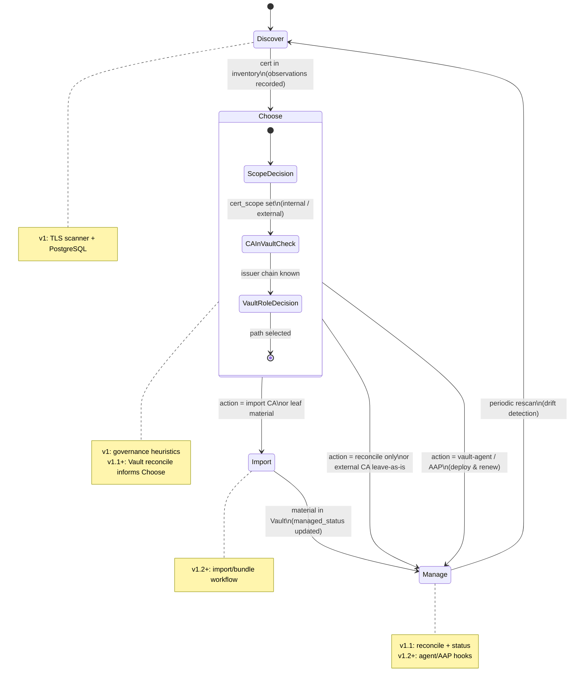
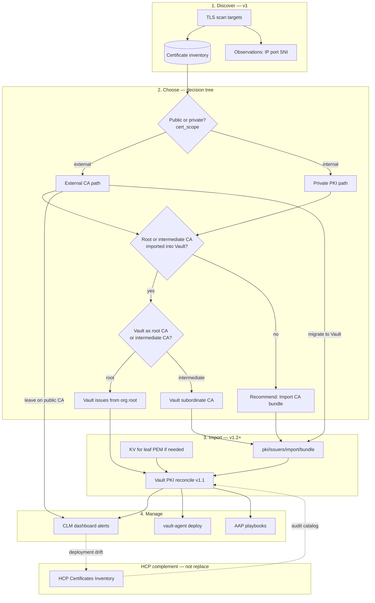
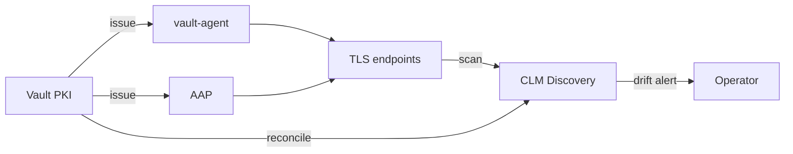

# CLM Lifecycle Workflow: Discover → Choose → Import → Manage

**Status:** Draft — pending user review  
**Date:** 2026-06-14  
**Issue:** [#20](https://github.com/glimpsovstar/hashicorp-vault-clm-discovery/issues/20) (lifecycle design; complements [#17](https://github.com/glimpsovstar/hashicorp-vault-clm-discovery/issues/17))  
**Repo:** [glimpsovstar/hashicorp-vault-clm-discovery](https://github.com/glimpsovstar/hashicorp-vault-clm-discovery)  
**Related specs:** [HCP Vault Dedicated cert inventory integration](2026-06-14-hcp-vault-cert-inventory-integration-design.md), [v1 product design](2026-06-14-vault-clm-discovery-v1-design.md), [scan report & Vault import workflow](2026-06-14-scan-report-and-vault-import-design.md)  
**Related docs:** `docs/architecture.md`, `docs/data-model.md`, `docs/reporting-architecture.md`, `README.md`

## Problem statement & user value

Operators need a **coherent certificate lifecycle story** that starts with what is actually deployed on the network and ends with sustainable management — not a one-shot inventory scan. Vault CLM Discovery is the **external discovery and governance layer** that sits alongside Vault PKI (and HCP Certificates Inventory on dedicated clusters).

This spec defines the **operator workflow** and how each phase maps to product versions, data fields, and integration with HCP. Implementation details for Vault PKI reconciliation and HCP reporting remain in the [HCP integration design spec](2026-06-14-hcp-vault-cert-inventory-integration-design.md).

### Intended lifecycle (before further implementation)

1. **Discover** — network TLS scan (v1 shipped)
2. **Choose** — decide governance path (public vs private, CA material in Vault, Vault PKI role)
3. **Import** — bring certs/CA material into Vault PKI or KV
4. **Manage** — ongoing CLM via this service, vault-agent, or Ansible Automation Platform (AAP)

---

## Lifecycle overview

### Flowchart (operator view)

---

## Phase 1: Discover

**Goal:** Build an authoritative **deployment inventory** — what certificates are presented on probed TLS endpoints, deduplicated by `fingerprint_sha256`, with where/when seen metadata.

| Aspect | v1 (today) | v1.1+ |
|--------|------------|-------|
| TLS network scan | Shipped (`internal/scanner`) | Same; optional post-scan reconcile hook |
| Dedup key | `fingerprint_sha256` | Unchanged |
| Observations | `certificate_observations` | Unchanged |
| Issuer chain capture | `issuers` table from presented chains | Same; feeds Import decisions |
| Governance at ingest | `cert_scope` via `governance.ClassifyScope` | Reconcile may refine scope for Vault-managed leaves |
| Vault link | None (all `managed_status = unmanaged`) | `managed_in_vault` after reconcile |

### Field mapping (Discover phase)

| Field | Set when | Notes |
|-------|----------|-------|
| `fingerprint_sha256` | Upsert on probe | Primary identity |
| `cert_scope` | Upsert | Heuristic: public CA → `external`; internal CA / `.local` → `internal` |
| `managed_status` | Upsert default | `unmanaged` until reconcile or import |
| `status` | Upsert | `valid` / `expiring_soon` / `expired` from `not_after` |
| `vault_pki_mount` | — | null until reconcile/import |
| `chain_status` | Upsert | `complete`, `self_signed`, `incomplete`, `untrusted_root` |

### Non-goals (Discover)

- Issuing or renewing certificates
- Pushing discovered rows into HCP Certificates Inventory
- Automatic CA import without operator consent
- Scanning without explicit consent

### Post-scan report (v1.2+)

Completed scans can produce a **certificate-only environment report** (Radar-style sections: executive summary, cert health, expiry risk, issuer trust, scope, recommendations). Pipeline and formats: [`docs/reporting-architecture.md`](../../reporting-architecture.md). Design and import workflow: [scan report & Vault import spec](2026-06-14-scan-report-and-vault-import-design.md). Builds on scan diagnostics from [#14](https://github.com/glimpsovstar/hashicorp-vault-clm-discovery/issues/14).

---

## Phase 2: Choose

**Goal:** For each discovered certificate (or issuer), select the **governance and Vault PKI strategy** before import or manage actions.

### Decision dimensions

| ID | Question | Maps to | v1 behavior |
|----|----------|---------|-------------|
| **2a** | Public or private? | `cert_scope` (`external` / `internal`) + governance columns | Heuristic at scan; operator may PATCH override |
| **2b** | Has the root or intermediate CA been imported into Vault? | Issuer in `issuers` + Vault `LIST issuers` (v1.1+) | Chain analysis only; no Vault call in v1 |
| **2c** | Will Vault act as **root CA** or **intermediate CA**? | PKI mount topology (Q2 planning) | Documented guidance only; not automated in v1.x |

### Decision matrix (2a × 2b × 2c)

Rows use: **Scope** = external (E) / internal (I); **CA in Vault** = yes (Y) / no (N); **Vault role** = root (R) / intermediate (I′).

| # | Scope | CA in Vault | Vault role | Typical situation | Recommended action | Target fields |
|---|-------|-------------|------------|-------------------|--------------------|---------------|
| 1 | E | N | — | Public CA leaf (Let's Encrypt, DigiCert) on ingress | **Manage externally** or migrate: import org CA if moving to Vault PKI; else monitor expiry in CLM | `managed_status=unmanaged`, `cert_scope=external`, `status` from dates |
| 2 | E | Y | R | Vault-root issued cert seen on public endpoint | Reconcile → **Manage via Vault PKI**; validate SAN/public exposure policy | `managed_in_vault`, `cert_scope=external`* , `vault_pki_mount` set |
| 3 | E | Y | I′ | Subordinate CA issued public-facing cert | Reconcile; confirm intermediate chain in Vault; renew via issuing mount | Same as #2 |
| 4 | E | N | R/I′ | External leaf, private CA not yet in Vault | **Import CA bundle** (`pki/issuers/import/bundle`), then issue/replace via Vault | After import: `imported` on issuer; leaf → reconcile |
| 5 | I | N | — | Private CA / self-signed on internal hostname | **Import CA** or stand up Vault PKI root/intermediate; until then CLM-only monitoring | `cert_scope=internal`, `unmanaged` |
| 6 | I | Y | R | Org internal PKI, Vault is root | Reconcile; **Manage** via Vault + optional vault-agent/AAP for deploy | `managed_in_vault`, `cert_scope=internal` |
| 7 | I | Y | I′ | Vault intermediate signs internal services | Reconcile both mounts; import cross-sign if split chain | `vault_pki_mount`, `vault_issuer_ref` |
| 8 | I | N | R/I′ | Internal cert, unknown issuer not in Vault | **Discover issuer** from chain → Import CA → Choose role (2c) → Import/issue | `issuers` row + import workflow |

\* **Scope override policy:** Vault-managed leaf certs from org PKI typically imply `internal` unless deliberately issued for public names; operator PATCH or future rule may force `external` for internet-facing SANs. See open questions.

### Choose phase outputs (conceptual)

| Output | Description |
|--------|-------------|
| `reconcile_only` | Cert already in Vault PKI; run v1.1 reconcile |
| `import_ca` | Issuer missing; run import/bundle (v1.2) |
| `manage_external` | Stay on public CA; CLM expiry/observation alerts only |
| `deploy_via_agent` | vault-agent template for leaf deploy (v1.2+) |
| `deploy_via_aap` | AAP job template references Vault path (v1.2+) |

### Non-goals (Choose)

- Fully automated policy engine without operator consent
- Auto-selecting root vs intermediate CA topology (Q2 — human decision)
- Writing to Vault PKI during Choose (read-only reconcile except explicit Import)

---

## Phase 3: Import

**Goal:** Load CA bundles, intermediates, or leaf material into Vault so PKI can issue, validate, or reconcile.

| Capability | Version | Mechanism |
|------------|---------|-----------|
| Detect issuers from scan chains | v1 | `issuers` table |
| Import CA via Vault API | v1.2+ | `POST {mount}/issuers/import/bundle` |
| Mark imported issuers | v1.2+ | `managed_status = imported` on issuer rows; link to `vault_issuer_ref` |
| Leaf PEM to KV (escape hatch) | v1.2+ | Optional; not preferred vs PKI issue |
| Operator confirmation | All | No silent import; audit log + API consent |

### Field mapping (Import phase)

| Field | After CA import | After leaf reconcile |
|-------|-----------------|----------------------|
| `managed_status` | `imported` (issuer) / pending reconcile (leaf) | `managed_in_vault` |
| `vault_pki_mount` | Set to target mount | Set |
| `vault_issuer_ref` | Vault-assigned issuer id | From cert metadata |
| `cert_scope` | Unchanged unless operator overrides | May align with mount policy |
| `status` | From x509 dates | + revocation in v1.1b |

### Non-goals (Import)

- Bulk import of every discovered public-CA leaf into Vault (low value)
- Import without validating chain trust and operator authorization
- Replacing HCP Certificates Inventory or backfilling HCP telemetry

---

## Phase 4: Manage

**Goal:** Ongoing lifecycle — expiry alerts, revocation alignment, deployment drift, renewal orchestration.

| Track | Version | Description |
|-------|---------|-------------|
| **CLM Discovery** | v1 / v1.1 | Dashboard, rescan, reconcile, governance PATCH |
| **Vault PKI** | v1.1 | Source of truth for issued certs; HCP Inventory on HVD |
| **vault-agent** | v1.2+ | Deploy/renew leaf certs to apps; CLM validates deployment |
| **AAP** | v1.2+ | Playbooks for cert deploy; Vault lookup via automation |

### Manage phase field usage

| Field | Manage use |
|-------|------------|
| `managed_status` | `managed_in_vault` → treat as Vault-owned; `unmanaged` → external renewal path |
| `cert_scope` | Policy: external public certs may require stricter expiry windows |
| `status` / `days_until_expiry` | Alerting |
| `vault_pki_mount` | Deep link to mount / role for renewal |
| `remediation_state` | Future workflow (`none` → `planned` → `in_progress`) |
| `owner`, `team`, `environment`, `tags` | Routing alerts and AAP job selection |

### Non-goals (Manage)

- Becoming a full replacement for vault-agent or AAP
- Automatic renewal without integration hooks (v1.1)
- Issue/revoke from CLM API (read-only reconcile)

---

## Version roadmap summary

| Phase | v1 (shipped) | v1.1 | v1.1b | v1.2+ | v2+ |
|-------|--------------|------|-------|-------|-----|
| **Discover** | TLS scan, inventory, observations, scope heuristics | Post-scan reconcile hook (optional) | — | Scheduled drift scans | Cloud CA sources |
| **Choose** | Manual review in dashboard | Reconcile informs managed/unmanaged | Revocation in Choose | Choose wizard / recommended actions | Policy engine |
| **Import** | Issuer table from chains | Read issuers from Vault | — | `import/bundle` API workflow | Bulk CA onboarding |
| **Manage** | Expiry badges, governance PATCH | PKI reconcile, Vault column | OCSP/CRL `status=revoked` | vault-agent/AAP links, HCP export ingest | Risk scoring |

Detailed Vault PKI reconcile and HCP integration: [HCP integration spec § Phased delivery](2026-06-14-hcp-vault-cert-inventory-integration-design.md#phased-delivery).

---

## HCP Certificates Inventory integration

HCP and CLM Discovery are **complementary products** in the Manage phase:

| View | Source | Answers |
|------|--------|---------|
| **HCP Certificates Inventory** | PKI telemetry → HCP control plane | What Vault **issued/revoked** (audit, role, mount, serial) |
| **CLM Discovery** | Network scan + Vault PKI API reconcile | What is **deployed** on TLS endpoints; unmanaged/shadow certs |

- **v1.1:** Reconcile via **Vault PKI HTTP API** (works for HCP Vault Dedicated and self-managed Enterprise/OSS). Same fingerprint match as CLM inventory.
- **v1.2 (optional):** HCP Vault Reporting API or portal export for audit columns — HCP-only; does not replace reconcile.
- **Never:** Push scan results into HCP inventory (telemetry-only).

Cross-reference: [HCP integration spec — Integration architecture](2026-06-14-hcp-vault-cert-inventory-integration-design.md#integration-architecture).

---

## Edge cases & gaps

| Scenario | Detection | Gap / handling |
|----------|-----------|----------------|
| Cert on wire, not in Vault PKI | Scan yes; reconcile no match | `managed_status=unmanaged`; Choose → import or external manage |
| Vault-issued, never deployed | Reconcile/HCP yes; no observation | Not in CLM inventory; visible in HCP only — optional "Vault-only" list (deferred v1.1) |
| Public cert from public CA | `cert_scope=external`, public issuer DN | Manage via CA vendor or migrate to Vault; no import of leaf to PKI store |
| Private PKI, public DNS name | Scope heuristic may say `external` | Operator override; policy review |
| Split chain / missing intermediate | `chain_status=incomplete` | Import missing intermediate; re-scan |
| Expired before import | `status=expired` | Import for history only; re-issue required |
| Multi-mount cluster | Same fingerprint in multiple mounts | Match first or allowlist `VAULT_PKI_MOUNTS`; document ambiguity |
| ACME / SCEP issued via Vault | In PKI store + HCP telemetry | Reconcile matches; Manage via same Vault role |
| Pre-reporting certs (HCP) | In Vault PKI, absent from HCP UI | Vault API reconcile is authoritative; HCP gap expected |
| Operator overrides scope | PATCH `cert_scope` | Heuristics must not overwrite without explicit rule |
| `no_store` PKI role | Not in LIST certs | Reconcile miss; HCP may also lack row — flag as limitation |
| Revoked but still on wire | v1.1b revocation check | `status=revoked` + observation drift alert |
| Cross-namespace PKI | HVD child namespaces | Reconcile must honor `X-Vault-Namespace` |

---

## Open questions

Consolidates lifecycle questions and [HCP spec open questions](2026-06-14-hcp-vault-cert-inventory-integration-design.md#open-questions-for-user).

### Vault access & topology

1. **Vault API reachability:** Can CLM reach `djoo-test-vault` from its deployment (public endpoint vs private link)? Preferred auth: AppRole vs AWS IAM?
2. **PKI mounts:** Beyond `pki/`, which mounts matter? Allowlist vs auto-discover?
3. **Namespace model:** Single admin namespace or child namespaces for PKI?
4. **Root vs intermediate (2c):** For Q2, does the org standardize Vault-as-root or subordinate intermediate only? Affects import and mount layout — not automated in v1.x.

### Reconcile & reporting

5. **Reconcile trigger:** After every scan, scheduled, or manual only?
6. **Pre-reporting certs:** Certs issued before HCP reporting enablement exist in Vault PKI but not HCP Inventory — confirm Vault API reconcile as authoritative for CLM?
7. **Vault-only certs:** Show "issued in Vault, not seen on network" list in CLM v1.1, or defer to HCP Portal?

### Classification & workflow

8. **cert_scope override:** Should `managed_in_vault` leaves always set `internal`, or keep `governance.ClassifyScope` heuristics (e.g. public SAN → `external`)?
9. **Choose UX:** Wizard in dashboard vs export/report for v1.2?
10. **Import approval:** Single operator role or dual-control for CA import?

### Manage integrations

11. **vault-agent:** Which demo targets (e.g. `aap.david-joo.sbx.hashidemos.io`) should v1.2 link as reference architecture?
12. **AAP:** Read-only inventory feed vs webhook on expiry — preferred integration point?

---

## Acceptance criteria (future implementation)

Derived from lifecycle phases; detailed reconciler AC in [HCP spec](2026-06-14-hcp-vault-cert-inventory-integration-design.md#acceptance-criteria-future-implementation-issue).

- [ ] Operator can run Discover → view inventory with `cert_scope`, `status`, observations (v1 — done)
- [ ] Choose decision matrix documented in operator guide; dashboard surfaces scope + managed status (v1.1)
- [ ] Reconcile sets `managed_status`, `vault_pki_mount`, `vault_issuer_ref` per matrix rows 2, 3, 6, 7 (v1.1)
- [ ] Import workflow sets `imported` on issuers and enables subsequent reconcile (v1.2)
- [ ] Manage docs describe CLM + HCP + agent/AAP division of responsibility
- [ ] Edge cases above have documented behavior or explicit deferral

---

## References

- [HCP Vault Dedicated cert inventory integration design](2026-06-14-hcp-vault-cert-inventory-integration-design.md)
- [Vault CLM Discovery v1 design](2026-06-14-vault-clm-discovery-v1-design.md)
- `docs/architecture.md`, `docs/data-model.md`
- [HCP certificates inventory reporting](https://developer.hashicorp.com/hcp/docs/vault/reporting/certificates-inventory-reporting)
- [Vault PKI import bundle](https://developer.hashicorp.com/vault/api-docs/secret/pki#import-ca-certificates-and-key)
