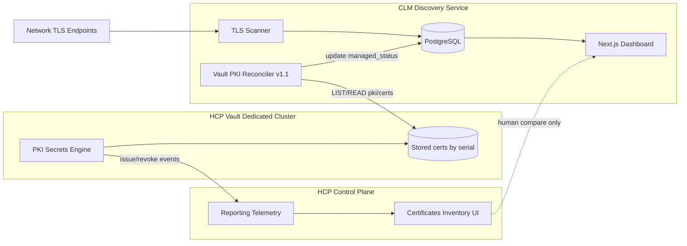
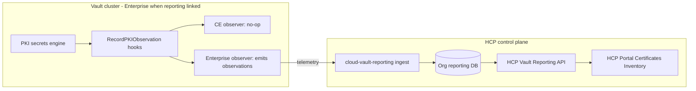
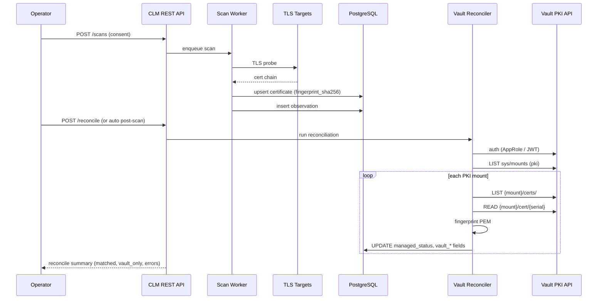

# HCP Vault Dedicated Certificate Inventory Integration

**Status:** Draft — pending user review  
**Date:** 2026-06-14  
**Issue:** [#17](https://github.com/glimpsovstar/hashicorp-vault-clm-discovery/issues/17)  
**Repo:** [glimpsovstar/hashicorp-vault-clm-discovery](https://github.com/glimpsovstar/hashicorp-vault-clm-discovery)  
**Related:** [CLM lifecycle workflow (Discover → Choose → Import → Manage)](2026-06-14-clm-lifecycle-workflow-design.md), v1.1 Vault PKI reconciliation (`docs/architecture.md`), `managed_status` / `cert_scope` (`docs/data-model.md`)

## Problem statement & user value

Operators running **HCP Vault Dedicated** with PKI enabled get a **Certificates Inventory** view in the HCP Portal — but that inventory only reflects certificates **issued or revoked through Vault PKI** (and only after cluster reporting is enabled). It does **not** answer:

- Which Vault-issued certificates are **actually deployed** on TLS endpoints (load balancers, VMs, ingress)?
- Which certificates are **in use on the network** but **not** managed by Vault (ACM, Let's Encrypt, legacy CAs)?
- Where a certificate was **last seen** (IP, port, SNI) and whether hostname/SAN alignment is correct?

**Vault CLM Discovery** fills the network-discovery gap: it probes TLS targets, deduplicates by `fingerprint_sha256`, and stores discovery metadata. The integration goal is to **reconcile** discovered certificates against the same Vault PKI authority that feeds HCP Certificates Inventory, so operators see a **single companion dashboard** with:

- **Vault** column = cert fingerprint matches a cert in Vault PKI (`managed_in_vault`)
- **Scope** = internal vs external (governance; Vault-managed leaf certs likely `internal`)
- **Where seen** = observations our tool captures; HCP does not provide

HCP Certificates Inventory remains the **audit/compliance** view inside HashiCorp Cloud; CLM Discovery remains the **deployment + drift** view alongside it. The products **complement** each other; they do not merge into one UI.

### Reference environment (user context)

| Item | Value |
|------|-------|
| HCP project | `david-joo-project` |
| Cluster | `djoo-test-vault` (Vault Dedicated, AWS `ap-southeast-2`) |
| Reporting enabled | Apr 10, 2026 — only PKI issue/revoke events **after** that date appear in HCP Certificates Inventory |
| Example mount path | `pki/` |

---

## What HCP Certificates Inventory is vs what we build

### HCP Certificates Inventory (HashiCorp-managed)

Per [HCP certificates inventory reporting](https://developer.hashicorp.com/hcp/docs/vault/reporting/certificates-inventory-reporting):

| Aspect | Behavior |
|--------|----------|
| **Data source** | Vault PKI secrets engine telemetry reported to HCP control plane — **not** a generic cert upload API |
| **Scope** | Certs issued/revoked via Vault PKI (plus ACME/SCEP/EST/CMPv2 paths Vault supports) |
| **Retroactive** | **No** — enabling reporting on an existing cluster does **not** backfill historical PKI certs into certificate inventory (unlike secrets inventory scan) |
| **UI** | HCP Portal → Vault Dedicated → **Certificates Inventory** (CN, status, role, valid until, mount path, issuer, serial, revoked at, …) |
| **Export** | Portal **Export** → JSON/CSV (max **1,000** rows per export) |
| **API** | HCP **Vault Reporting** API (`GET /vault-reporting/2025-05-05/.../reports/certificates-inventory`) is documented in [`hashicorp/cloud-vault-reporting`](https://github.com/hashicorp/cloud-vault-reporting/blob/main/docs/api-docs/20250505.md) — a **cloud control-plane** service, not the Vault cluster HTTP API. The separate HCP **Vault cluster lifecycle** API (`api.cloud.hashicorp.com/vault/...`) does not list certificate inventory rows. |
| **Auth** | HCP IAM (admin, Report reader role) for portal; Vault tokens/policies for cluster API |

### Vault CLM Discovery (this project)

| Aspect | Behavior |
|--------|----------|
| **Data source** | Active TLS network scan (`internal/scanner`) |
| **Scope** | Any certificate **presented** on probed IP:port/hostname — Vault, public CA, self-signed |
| **Dedup key** | `fingerprint_sha256` (aligned with Vault PKI cert objects) |
| **Unique value** | `certificate_observations` (where/when seen), chain analysis, governance enrichment |
| **Vault link (v1.1)** | `managed_status`, `vault_pki_mount`, `vault_issuer_ref` via reconciliation — **not** by pushing rows into HCP |

### Integration models (clarified)

| Model | Feasible? | Role |
|-------|-----------|------|
| **Reconciliation** | **Yes — primary (v1.1)** | After scan, list/read Vault PKI stored certs; match `fingerprint_sha256` (fallback: serial + mount); set `managed_in_vault`, populate Vault fields |
| **Push to HCP Inventory** | **No** | HCP inventory is PKI-engine-sourced telemetry; external scan results cannot be injected into the HCP Certificates Inventory UI |
| **Complement** | **Yes — product positioning** | CLM finds **unmanaged** and **mis-deployed** certs; HCP shows **Vault issuance catalog** and revocation audit trail operators may never scan |



---

## Vault Enterprise vs HCP Certificates Inventory

Research target: [`hashicorp/vault`](https://github.com/hashicorp/vault) (OSS binary + UI) cross-checked against [`hashicorp/cloud-vault-reporting`](https://github.com/hashicorp/cloud-vault-reporting) (public HCP reporting service) and HCP docs. [`hashicorp/vault-enterprise`](https://github.com/hashicorp/vault-enterprise) is **private**; enterprise-only observer behavior is inferred from OSS stubs plus `cloud-vault-reporting` README (local dev builds a Vault Enterprise image).

### Summary answers

| Question | Answer (evidence-based) |
|----------|-------------------------|
| Is HCP Certificates Inventory a cloud-only control plane UI fed by Vault PKI telemetry? | **Yes.** HCP Portal UI lives in [`hashicorp/shared-secure-ui`](https://github.com/hashicorp/shared-secure-ui) (`certificates-inventory` routes). Data is served by [`hashicorp/cloud-vault-reporting`](https://github.com/hashicorp/cloud-vault-reporting) (`FetchCertificatesInventory`, org DB tables `pki_leaf_certificates`, etc.). Vault PKI emits **observation events** on issue/revoke (and ACME/SCEP/EST/CMPv2 paths); HCP docs describe reporting as **telemetry**-based ([certificates inventory reporting](https://developer.hashicorp.com/hcp/docs/vault/reporting/certificates-inventory-reporting)). |
| Does Vault Enterprise (self-managed) expose an equivalent in-Vault UI or org-wide inventory API? | **No equivalent Certificates Inventory product in the Vault binary UI.** OSS Vault sidebar **Reporting** nav exposes only **Vault usage** and **License** ([`ui/lib/core/addon/components/sidebar/nav/reporting.hbs`](https://github.com/hashicorp/vault/blob/main/ui/lib/core/addon/components/sidebar/nav/reporting.hbs)); zero matches for `certificates-inventory` / `secrets-inventory` under `ui/`. **Usage reporting** (leases, replication, billing-style metrics) is not certificate inventory. Operators on self-managed Enterprise reconcile via **Vault PKI HTTP API** (list/read stored certs) or custom tooling — not an HCP-style inventory dashboard inside Vault. |
| What PKI APIs exist in OSS Vault that both deployment models share? | **`LIST {mount}/certs/`** (serials), **`READ {mount}/cert/{serial}`** (PEM + metadata), **`LIST sys/mounts`** (discover PKI mounts), plus revocation list paths. Implemented in OSS: [`builtin/logical/pki/path_fetch.go`](https://github.com/hashicorp/vault/blob/main/builtin/logical/pki/path_fetch.go) (`pathFetchListCerts`, `pathFetchValid`). Documented: [Vault PKI API — List certificates](https://developer.hashicorp.com/vault/api-docs/secret/pki#list-certificates). |
| Can CLM integrate once against Vault PKI API and cover both models? | **Yes — recommended.** Same stored-cert source whether the cluster is HCP Vault Dedicated or self-managed Enterprise/OSS. HCP Certificates Inventory is a **filtered, telemetry-fed audit view** (issue/revoke after reporting enablement); Vault PKI API is the **authoritative stored-cert catalog** for reconciliation, including pre-reporting issuances. |

### Comparison table

| Capability | HCP Vault Dedicated Certificates Inventory | Vault Enterprise (self-managed) | OSS / Enterprise Vault PKI API |
|------------|-------------------------------------------|----------------------------------|--------------------------------|
| **Where it runs** | HCP Portal + `cloud-vault-reporting` control plane | Not available as same product | Vault cluster HTTP API (`/v1/...`) |
| **UI** | HCP → Vault Dedicated → **Certificates Inventory** | Vault UI: **Vault usage** / **License** only under Reporting | PKI mount UI (per-mount ops); no org-wide cert inventory page |
| **Data source** | PKI **telemetry observations** ingested after reporting enabled | N/A (no HCP reporting pipeline unless linked to HCP) | PKI storage (`issuing.PathCerts`); list/read endpoints |
| **Backfill on enable reporting** | **Secrets inventory:** cluster scan populates ([HCP reporting index](https://developer.hashicorp.com/hcp/docs/vault/reporting/index)). **Certificates inventory:** **no backfill** — only certs issued/revoked **after** enablement | N/A | Full stored cert list via `LIST {mount}/certs/` regardless of reporting |
| **Programmatic access** | HCP Vault Reporting API: `GET .../reports/certificates-inventory` ([`cloud-vault-reporting` API docs](https://github.com/hashicorp/cloud-vault-reporting/blob/main/docs/api-docs/20250505.md)) | No in-Vault certificates inventory API | `LIST/READ` PKI paths; client in [`api/`](https://github.com/hashicorp/vault/tree/main/api) |
| **Auth** | HCP IAM (admin, Report reader) + HCP token for reporting API | Vault token/policy | Vault token/policy |
| **Export cap** | Portal export max **1,000** rows (HCP docs) | N/A | No built-in export; paginate via LIST |
| **Network / deployment visibility** | None | None | None — CLM Discovery value-add |
| **In OSS Vault binary?** | **No** (HCP-only) | **No** (no cert inventory UI/API) | **Yes** (PKI engine + API) |

### Telemetry path (HCP only)



**OSS facts from `hashicorp/vault`:**

- PKI calls `RecordPKIObservation` on issue, revoke, root/intermediate generation, ACME/SCEP/EST/CMPv2, etc. ([`builtin/logical/pki/observe/observation_consts.go`](https://github.com/hashicorp/vault/blob/main/builtin/logical/pki/observe/observation_consts.go), e.g. `path_root.go`, `secret_certs.go`).
- Community Edition observer is explicitly a **no-op** ([`builtin/logical/pki/observe/observer_ce.go`](https://github.com/hashicorp/vault/blob/main/builtin/logical/pki/observe/observer_ce.go): *"No-op for Community Edition"*). Enterprise implementation is not in the public repo.
- `POST /v1/sys/reporting/scan` writes Vault state files to `reporting_scan_directory` ([`api/sys_reporting_scan.go`](https://github.com/hashicorp/vault/blob/main/api/sys_reporting_scan.go), [`changelog/_10068.txt`](https://github.com/hashicorp/vault/blob/main/changelog/_10068.txt)). HCP docs state this **scan backfills secrets inventory only**, not certificate inventory ([HCP reporting index — Warning](https://developer.hashicorp.com/hcp/docs/vault/reporting/index)).
- GitHub code search: **0** matches for `certificates-inventory` or `FetchCertificatesInventory` in `hashicorp/vault`; **0** matches for `certificates inventory` in `hashicorp/vault` UI.

**HCP-only facts from `hashicorp/cloud-vault-reporting` (public):**

- Service README: *"Vault Reporting for Secure Governance"*; local dev uses **Vault Enterprise** image ([`README.md`](https://github.com/hashicorp/cloud-vault-reporting/blob/main/README.md)).
- Public API `FetchCertificatesInventory` at `/vault-reporting/2025-05-05/organizations/{org}/projects/{project}/clusters/{cluster_id}/reports/certificates-inventory` ([`docs/api-docs/20250505.md`](https://github.com/hashicorp/cloud-vault-reporting/blob/main/docs/api-docs/20250505.md)).
- Ingestion parses PKI observation types matching Vault constants (`pki/issue`, `pki/revoke`, `pki/acme/order/finalize-order`, etc.) ([`internal/ingest/observations/observation_type.go`](https://github.com/hashicorp/cloud-vault-reporting/blob/main/internal/ingest/observations/observation_type.go)).

### Corrections to earlier assumptions in this spec

| Prior assumption | Correction |
|----------------|------------|
| HCP has no documented certificates inventory API | **Partially wrong.** API is documented in **`hashicorp/cloud-vault-reporting`**, not the main HCP Vault cluster lifecycle API. Still **HCP-only** and **not** a substitute for Vault PKI reconciliation on self-managed clusters. |
| HCP inventory and Vault PKI store are the same snapshot | **Not always.** HCP cert inventory is **telemetry-sourced** and **forward-only** after reporting enablement; Vault PKI `LIST/READ` includes stored certs regardless of reporting window (subject to `no_store`, replication, and mount scope). |
| Vault Enterprise includes an in-cluster Certificates Inventory UI | **Not found in `hashicorp/vault`.** Enterprise adds usage/billing reporting UI, not HCP-style certificate inventory. |

### Integration recommendation (unchanged, strengthened)

**Primary target: Vault PKI HTTP API** (`LIST {mount}/certs/`, `READ {mount}/cert/{serial}`, `READ sys/mounts`). Works for HCP Vault Dedicated and self-managed Enterprise/OSS with the same reconciler.

**Optional v1.2 (HCP deployments only):** HCP Vault Reporting API or portal export for **audit metadata** (role, revoked by, mount accessor) — does not replace fingerprint reconciliation and does not cover self-managed Enterprise.

**Do not target:** pushing scan results into HCP inventory (telemetry-only, no injection API).

---

## Integration architecture

### Recommended approach: Vault PKI API reconciliation (v1.1)

**Why:** Same source of truth HCP inventory uses (Vault PKI), works for HCP Vault Dedicated and self-managed Vault Enterprise, no dependency on undocumented HCP reporting APIs, full cert PEM for fingerprint matching.

**Flow:**

1. Operator configures Vault connection (address, namespace, auth).
2. On schedule or post-scan trigger, reconciler discovers PKI mounts (`sys/mounts` filter `type=pki`).
3. For each mount: `LIST {mount}/certs/` → serial numbers; `READ {mount}/cert/{serial}` → PEM + metadata.
4. Compute SHA-256 fingerprint; match rows in `certificates` where `fingerprint_sha256` equal.
5. On match: `managed_status = managed_in_vault`, set `vault_pki_mount`, `vault_issuer_ref`, `serial_number` (normalized), optionally `cert_scope = internal` for leaf certs from org PKI.
6. Certs in Vault PKI with **no** network observation → remain only in HCP / Vault; optional future "Vault-only" import list in CLM (non-goal v1.1).

### Alternative A: HCP export ingest (v1.2 optional)

Periodic JSON/CSV export from HCP Portal (manual or scripted browser automation). Match on serial + mount path + CN. **Trade-offs:** 1k row cap, no observations, reporting window gap (pre–Apr 10 certs missing), fragile automation. **Use when:** Vault API access is restricted but operators can export HCP reports.

### Alternative B: Dual-pane operator workflow (v1.0 today)

No automation; operators compare HCP export with CLM inventory manually. **Trade-offs:** zero dev cost, error-prone. **Use when:** demo only.

**Recommendation:** Implement **Vault PKI API reconciliation** first; treat HCP export as optional supplemental audit cross-check in v1.2 if a public HCP reporting API does not appear.

---

## Data flow (v1.1 reconcile)



### Matching rules

| Priority | Key | Notes |
|----------|-----|-------|
| 1 | `fingerprint_sha256` | Primary; stable across scans |
| 2 | `serial_number` + `vault_pki_mount` | Secondary if fingerprint format differs |
| 3 | None | Leave `managed_status = unmanaged` |

### Reconciliation outcomes

| Discovered cert | In Vault PKI | `managed_status` | Operator insight |
|-----------------|--------------|------------------|------------------|
| Yes | Yes | `managed_in_vault` | Deployed and Vault-managed |
| Yes | No | `unmanaged` | Shadow cert / external CA |
| No | Yes | (no CLM row) | Issued but not seen on scanned targets — visible in HCP only |

---

## Authentication

### Vault API (v1.1 — required for reconciliation)

| Method | Fit | Notes |
|--------|-----|-------|
| **AppRole** | **Recommended** | Long-running CLM service; read-only policy on PKI paths |
| **Kubernetes JWT** | Good | If CLM runs in-cluster |
| **Cloud auth** (AWS IAM) | Good on HVD | Matches AWS `ap-southeast-2` deployment |
| **Admin token** | Dev/demo only | User's HCP cluster admin token; short TTL |

**HCP Vault Dedicated specifics:**

- Vault API URL: cluster **public** endpoint from HCP Portal (not `api.cloud.hashicorp.com`).
- **Namespace:** HVD clusters use admin namespace; set `X-Vault-Namespace` if using child namespaces.
- **TLS:** Verify server cert; optional custom CA for private endpoints.

**Suggested read-only policy (illustrative):**

```hcl
# List PKI mounts and read issued certs — no issue/revoke
path "sys/mounts" {
  capabilities = ["read"]
}
path "+/certs" {
  capabilities = ["list"]
}
path "+/cert/*" {
  capabilities = ["read"]
}
path "+/issuer/*" {
  capabilities = ["read"]
}
```

Separate policy for `pki/issuers/import/bundle` (write) — import workflow only.

### HCP API (v1.2 — optional, HCP deployments only)

| Use | API | Today |
|-----|-----|-------|
| Cluster metadata | `GET .../organizations/{org}/projects/{project}/clusters` | Documented (HCP Vault cluster lifecycle API) |
| Enable reporting | Cluster update `reporting_config` | Documented |
| **List certificate inventory** | `GET /vault-reporting/2025-05-05/.../reports/certificates-inventory` | Documented in [`hashicorp/cloud-vault-reporting` API docs](https://github.com/hashicorp/cloud-vault-reporting/blob/main/docs/api-docs/20250505.md); **HCP-only**, requires HCP IAM — not available on self-managed Enterprise |

**Conclusion:** v1.1 auth is **Vault-only** (works for both HCP Dedicated and self-managed). Optional v1.2 may add HCP Vault Reporting API for supplemental audit columns on HCP clusters only.

### Environment variables (proposed)

| Variable | Description |
|----------|-------------|
| `VAULT_ADDR` | Vault cluster URL |
| `VAULT_NAMESPACE` | Optional namespace |
| `VAULT_AUTH_METHOD` | `approle`, `kubernetes`, `aws`, `token` |
| `VAULT_ROLE_ID` / `VAULT_SECRET_ID` | AppRole |
| `VAULT_PKI_MOUNTS` | Optional allowlist (default: auto-discover all `pki`) |
| `RECONCILE_ON_SCAN_COMPLETE` | `true` to run after each scan |
| `RECONCILE_INTERVAL` | Optional cron duration |

---

## Field mapping

### CLM `certificates` ↔ Vault PKI `READ {mount}/cert/{serial}`

| CLM field | Vault PKI / x509 | HCP Certificates Inventory column |
|-----------|------------------|-----------------------------------|
| `fingerprint_sha256` | SHA-256 of DER | (not shown; derived) |
| `serial_number` | `serial_number` | Serial Number |
| `subject_cn` | CN | Common name |
| `subject_alt_names` | `alt_names` / PEM SANs | (partial via CN) |
| `issuer_dn` | issuer | Issuer |
| `not_before` | `not_before` | Valid from |
| `not_after` | `not_after` | Valid until |
| `key_type` | `private_key_type` / PEM | Algorithim |
| `key_bits` | `private_key_format` / PEM | Algorithim strength |
| `status` | derived + revocation | Status (Active/Expired) |
| `vault_pki_mount` | mount path | Mountpath |
| `vault_issuer_ref` | `issuer_id` / issuer name | Issuer |
| — | role name at issue time | Role |
| — | revocation metadata | Revoked at, Revoked by |
| — | leaf/root/intermediate | Certificate type |
| `managed_status` | presence in PKI store | Stored in vault (related) |

### CLM-only fields (no HCP equivalent)

| Field | Purpose |
|-------|---------|
| `certificate_observations.*` | IP, port, hostname, SNI, cipher |
| `hostname_matches_san` | Misconfiguration detection |
| `chain_status` | Trust path at probe time |
| `cert_scope` | Governance (`internal` / `external`) |
| `owner`, `team`, `environment`, `tags` | Manual enrichment |

### Status mapping

| CLM `status` | HCP Status | Condition |
|--------------|------------|-----------|
| `valid` / `expiring_soon` | Active | `not_after >= now`, not revoked |
| `expired` | Expired | `not_after < now` |
| `revoked` | (revoked quick filter) | Vault CRL / `revocation_time` (v1.1+) |

---

## Phased delivery

### Phase v1.1 — Vault PKI reconciliation (core)

- `internal/vault` client: auth, mount discovery, cert list/read
- Reconciliation job + API trigger (`POST /api/v1/reconcile` or scan hook)
- Update `managed_status`, `vault_pki_mount`, `vault_issuer_ref`, `serial_number`
- Dashboard: **Vault** column shows Connected when `managed_in_vault`
- Tests: table tests with mock Vault HTTP; fingerprint match fixtures
- Docs: README env vars, `architecture.md`, `data-model.md`

### Phase v1.1b — Revocation alignment

- OCSP/CRL checks for managed certs
- Align `status = revoked` with Vault revocation registry
- Cross-check HCP "Revoked" quick filter semantics

### Phase v1.2 — HCP reporting integration (optional)

- If HashiCorp ships **Certificates Inventory API**: read-only sync for audit metadata (role, revoked by, mount accessor)
- Else: optional **HCP export importer** (JSON/CSV upload endpoint) for operators who cannot use Vault API
- Link-out in dashboard: "View in HCP" deep link to cluster Certificates Inventory (URL pattern TBD)

### Phase v2+ — Broader CLM

- Cloud CA sources (ACM, etc.) — still `unmanaged` relative to Vault
- Risk scoring using managed + expiry + observation drift

---

## Non-goals

- **Injecting** network-discovered certificates into HCP Certificates Inventory
- **Replacing** HCP inventory for compliance audit trails
- **Writing** to Vault PKI (issue/revoke) from CLM — read-only reconcile except explicit CA `import/bundle` workflow
- **Backfilling** HCP reporting for certs issued before reporting enable date
- **Single merged UI** — two products, linked by reconciliation semantics and operator workflow

---

## Open questions (for user)

> **Consolidated list:** Lifecycle-specific questions (Choose/Import/Manage, vault-agent, AAP) plus the items below are merged in [CLM lifecycle workflow spec § Open questions](2026-06-14-clm-lifecycle-workflow-design.md#open-questions).

1. **Vault access:** Can CLM Discovery reach the `djoo-test-vault` Vault API from its deployment network (public endpoint vs private link)? Which auth method is preferred (AppRole vs AWS IAM)?
2. **PKI mounts:** Which mount paths matter beyond `pki/`? Multi-mount clusters need allowlist vs auto-discover policy.
3. **Reconcile trigger:** Run automatically after every scan, on a schedule, or manual button only?
4. **Pre-reporting certs:** Certs issued before Apr 10, 2026 exist in Vault PKI but not in HCP Inventory — is Vault API reconciliation the authoritative path (recommended), or is HCP export comparison required for audit demos?
5. **Namespace model:** Single admin namespace or child namespaces for PKI?
6. **cert_scope override:** Should `managed_in_vault` leaf certs always set `cert_scope = internal`, or remain governed by `governance.ClassifyScope` heuristics?
7. **Vault-only certs:** Should v1.1 show a separate "issued in Vault, not seen on network" list in CLM, or defer to HCP Portal for that gap?

---

## Acceptance criteria (future implementation issue)

- [ ] Configure Vault connection via env vars; authenticate with AppRole (or documented alternative) against HCP Vault Dedicated cluster
- [ ] Discover PKI mounts and list stored certificate serials without write permissions
- [ ] Read cert PEM/metadata and match at least one discovered cert by `fingerprint_sha256`, setting `managed_status = managed_in_vault`
- [ ] Populate `vault_pki_mount` and `vault_issuer_ref` on matched rows
- [ ] Leave non-matching discovered certs as `unmanaged`
- [ ] Reconciliation idempotent — repeated runs do not duplicate or corrupt rows
- [ ] API returns reconciliation summary (mounts scanned, certs read, matches, errors)
- [ ] Dashboard **Vault** column reflects reconciliation (`Connected` / `Not connected`)
- [ ] Read-only Vault policy documented in README
- [ ] `go test ./...` includes reconciler unit tests with HTTP mocks
- [ ] Docs updated: README, `architecture.md`, `data-model.md`
- [ ] Demo script notes HCP Certificates Inventory as complementary view (not fed by CLM)

---

## References

- [HCP Vault Dedicated inventory reporting](https://developer.hashicorp.com/hcp/docs/vault/reporting)
- [Certificates inventory reporting](https://developer.hashicorp.com/hcp/docs/vault/reporting/certificates-inventory-reporting)
- [HCP Vault API (cluster management)](https://developer.hashicorp.com/hcp/api-docs/vault)
- [HCP Vault Reporting API (certificates inventory — `hashicorp/cloud-vault-reporting`)](https://github.com/hashicorp/cloud-vault-reporting/blob/main/docs/api-docs/20250505.md)
- [Vault PKI secrets engine API](https://developer.hashicorp.com/vault/api-docs/secret/pki)
- Vault OSS source (PKI list/read, observations, reporting scan):
  - [`builtin/logical/pki/path_fetch.go`](https://github.com/hashicorp/vault/blob/main/builtin/logical/pki/path_fetch.go)
  - [`builtin/logical/pki/observe/observer_ce.go`](https://github.com/hashicorp/vault/blob/main/builtin/logical/pki/observe/observer_ce.go)
  - [`builtin/logical/pki/observe/observation_consts.go`](https://github.com/hashicorp/vault/blob/main/builtin/logical/pki/observe/observation_consts.go)
  - [`api/sys_reporting_scan.go`](https://github.com/hashicorp/vault/blob/main/api/sys_reporting_scan.go)
  - [`ui/lib/core/addon/components/sidebar/nav/reporting.hbs`](https://github.com/hashicorp/vault/blob/main/ui/lib/core/addon/components/sidebar/nav/reporting.hbs)
- Project: `docs/architecture.md`, `docs/data-model.md`, `README.md`
