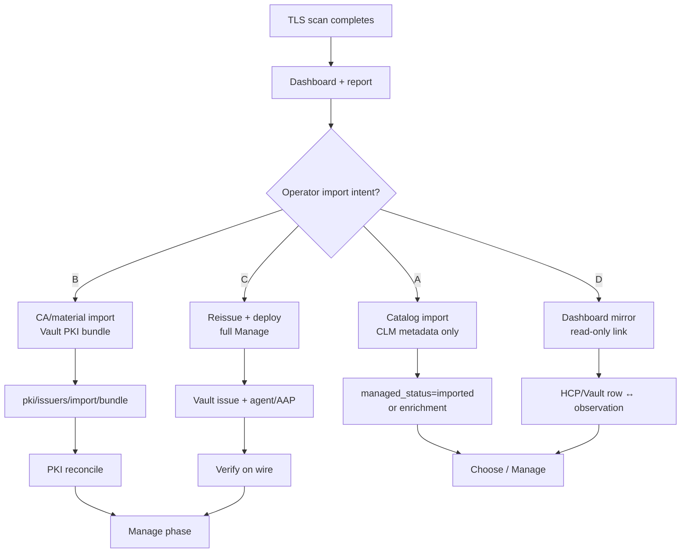
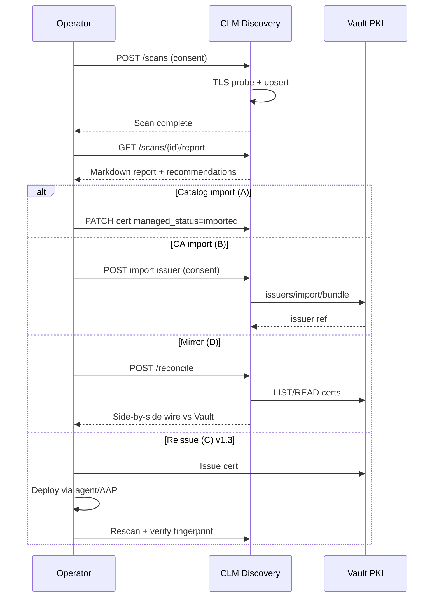

# Environment scan report & Vault import workflow

**Status:** Draft — pending user review  
**Date:** 2026-06-14  
**Issues:** [#24](https://github.com/glimpsovstar/hashicorp-vault-clm-discovery/issues/24) (scan report), [#25](https://github.com/glimpsovstar/hashicorp-vault-clm-discovery/issues/25) (Vault import workflow); parent [#20](https://github.com/glimpsovstar/hashicorp-vault-clm-discovery/issues/20)  
**Related specs:** [CLM lifecycle workflow](2026-06-14-clm-lifecycle-workflow-design.md), [HCP integration](2026-06-14-hcp-vault-cert-inventory-integration-design.md), [reporting architecture](../../reporting-architecture.md)  
**Related docs:** `docs/architecture.md`, `docs/data-model.md`, `docs/program-context.md`

## Problem statement

Operators completing a **Discover** scan need two capabilities beyond the current dashboard:

1. **Environment scan report** — a Vault Radar–style, certificate-only summary they can share with stakeholders (expiry risk, issuer trust, scope, recommendations).
2. **Import workflow clarity** — “import into Vault” is ambiguous; the product must distinguish catalog tracking, CA material import, full reissue/deploy, and read-only inventory mirroring.

This spec defines both features, maps them to lifecycle phases, recommends phasing, and lists **open questions for the user**.

---

## Feature 1: Environment scan report

### User value

- Answer “what did we find on the network?” in one document after a scan.
- Support demo narrative: scan → report → choose import path → manage.
- Complement [#14](https://github.com/glimpsovstar/hashicorp-vault-clm-discovery/issues/14) diagnostics (probe failures) with **cert governance insights**.

### Vault Radar alignment

Studied [`hashicorp/vault-scanning-and-insights-cli`](https://github.com/hashicorp/vault-scanning-and-insights-cli):

| Radar pattern | CLM report equivalent |
|---------------|----------------------|
| Risk/insight rows with severity | Cert/issuer/scan insights |
| Scan summary counts | Targets, certs, failures |
| CSV / JSON / SARIF output | Markdown + JSON + CSV |
| HCP portal upload | Dashboard + API download (no HCP Radar) |
| Category + type taxonomy | `certificate`, `issuer`, `governance`, `scan` |

**Scope limit:** Certificate and CA material only — not secrets, PII, Vault policy, or auth posture.

### Lifecycle mapping

| Phase | Report role |
|-------|-------------|
| **Discover** | Primary output of completed scan; feeds Choose |
| **Choose** | Recommendations section suggests import vs reconcile vs external |
| **Import** | Lists issuers needing `import/bundle` |
| **Manage** | Expiry and drift sections; delta vs prior scan (v1.3) |

### Architecture reference

Full pipeline, sections, formats, and non-goals: **[`docs/reporting-architecture.md`](../../reporting-architecture.md)**.

### Phasing

| Version | Deliverables |
|---------|--------------|
| **v1.2** | `GET /api/v1/scans/{id}/report`, Markdown default, JSON + CSV, dashboard download on scan detail |
| **v1.3** | Baseline/delta vs prior scan, optional SARIF, scheduled summary email/webhook |

### Acceptance criteria (future)

- [ ] Completed scan produces downloadable Markdown report with all sections in reporting-architecture template
- [ ] Report includes [#14](https://github.com/glimpsovstar/hashicorp-vault-clm-discovery/issues/14) diagnostics (failure samples, expansion warnings)
- [ ] Insights use severity + recommendation codes; no full PEM in Markdown body
- [ ] JSON report schema versioned; CSV export matches insight flat list
- [ ] Non-goals documented and absent from report content

---

## Feature 2: Scan → display → import into Vault

### The ambiguity

“Import” is used loosely in CLM conversations. This spec names **four interpretations** and recommends how to phase them.

### Interpretation A: Catalog import

**Definition:** Operator marks a discovered cert (or issuer) as **tracked** in CLM without mutating Vault PKI.

| Aspect | Detail |
|--------|--------|
| Vault writes | None |
| CLM writes | `managed_status=imported` and/or governance enrichment (`owner`, `team`, `environment`, `tags`, `remediation_state`) |
| Use case | “We acknowledge this shadow cert; monitor expiry here until we migrate.” |
| Lifecycle | **Choose** → lightweight **Manage** (CLM-only) |
| Demo fit | **Best first** — safe, no Vault credentials beyond optional read-only reconcile |

**Distinct from:** Vault PKI stored cert import. The `imported` enum value means **catalogued for CLM workflow**, not “PEM loaded into Vault.”

### Interpretation B: CA / material import

**Definition:** Import root/intermediate CA bundle into Vault PKI via [`POST {mount}/issuers/import/bundle`](https://developer.hashicorp.com/vault/api-docs/secret/pki#import-ca-certificates-and-key) without reissuing existing leaf certs.

| Aspect | Detail |
|--------|--------|
| Vault writes | Issuer material on chosen PKI mount |
| CLM writes | Issuer `managed_status=imported`, `vault_issuer_ref`, `vault_pki_mount`; leaves remain `unmanaged` until reissue |
| Use case | Private CA on wire not yet in Vault; enable future issuance/reconcile |
| Lifecycle | **Import** phase per [lifecycle spec](2026-06-14-clm-lifecycle-workflow-design.md#phase-3-import) |
| Version | **v1.2** (with Choose wizard) |

### Interpretation C: Reissue + deploy

**Definition:** Vault PKI issues a **replacement** cert; operator deploys via vault-agent, AAP, or manual install; CLM **rescans** to verify wire fingerprint matches Vault-issued material.

| Aspect | Detail |
|--------|--------|
| Vault writes | Issue cert (operator-initiated via Vault UI/API, not CLM API in v1.x) |
| CLM role | Orchestration links, drift detection, post-deploy validation |
| Use case | Full **Manage** — migrate endpoint from shadow cert to Vault-managed |
| Lifecycle | **Manage** (v1.2+ agent/AAP hooks, v1.3+ workflow state) |
| Version | **v1.3+** — out of demo MVP scope |

### Interpretation D: Dashboard-only mirror

**Definition:** Display a **read-only link** between a scan observation and a Vault PKI or HCP Certificates Inventory row — no write to either system.

| Aspect | Detail |
|--------|--------|
| Vault writes | None |
| HCP writes | None (cannot push scan rows into HCP inventory) |
| CLM writes | Optional link metadata (`vault_pki_mount`, serial, HCP row id as display-only) |
| Use case | Operator compares “on wire” vs “in Vault audit catalog” side by side |
| Lifecycle | **Choose** / **Manage** visibility; depends on v1.1 reconcile + optional v1.2 HCP ingest |
| Version | **v1.2** (mirror UI) alongside reconcile |

---

## Import decision tree

Use after scan + report review:

| Step | Question | If yes | If no |
|------|----------|--------|-------|
| 1 | Is the goal only to **track** this cert in CLM? | **A** Catalog import | → 2 |
| 2 | Is the **issuer CA** missing from Vault PKI? | **B** CA import (then Choose 2c) | → 3 |
| 3 | Does fingerprint match Vault PKI on reconcile? | **D** Mirror + `managed_in_vault` | → 4 |
| 4 | Should Vault **issue and deploy** a replacement? | **C** Reissue + deploy | **A** or monitor external |

### Mapping to `managed_status`

| Interpretation | `managed_status` after action | Notes |
|----------------|------------------------------|-------|
| A — Catalog | `imported` | CLM catalog sense; dashboard **Imported** column |
| B — CA import (issuer row) | `imported` on issuer | Leaf certs unchanged until reissue/reconcile |
| B — then reconcile leaf | `managed_in_vault` | Fingerprint match after Vault issues same cert |
| C — Reissue + deploy | `managed_in_vault` | After reconcile confirms wire match |
| D — Mirror only | `managed_in_vault` or `unmanaged` | Display link; status from reconcile, not import |

---

## Recommended phasing (demo default)

For the **Cursor SDLC demo**, implement in this order:

| Priority | Interpretation | Version | Rationale |
|----------|----------------|---------|-----------|
| 1 | **A — Catalog import** | v1.2 | No Vault write risk; completes “scan → display → mark imported” story; uses existing `managed_status` column |
| 2 | **D — Dashboard mirror** | v1.2 | Pairs with v1.1 reconcile; shows complement to HCP inventory without false “import” semantics |
| 3 | **B — CA import** | v1.2 | Lifecycle **Import** phase demo; requires Vault policy + consent modal |
| 4 | **C — Reissue + deploy** | v1.3+ | Needs agent/AAP reference arch and issue API boundaries CLM does not own |

**Demo default when user says “import” without qualifier:** assume **A (catalog import)** in UI copy, with explicit dropdown for B/C in v1.2 Choose wizard.

### v1.2 / v1.3 summary

| Version | Scan report | Import A | Import B | Import C | Mirror D |
|---------|-------------|----------|----------|----------|----------|
| v1.1 | — | — | — | — | Reconcile only |
| **v1.2** | Markdown/JSON/CSV | PATCH `managed_status` + wizard | `import/bundle` API workflow | Links/docs only | Linked inventory UI |
| **v1.3** | Delta/baseline | Bulk catalog | Bulk CA onboarding | Deploy verify loop | HCP export cross-link |

---

## End-to-end operator flow (target)

---

## Edge cases

| Scenario | Handling |
|----------|----------|
| Operator catalog-imports (`A`) then CA-imports same issuer (`B`) | Issuer row upgrades to Vault-linked `imported`; cert rows reconcile independently |
| Public CA leaf (Let’s Encrypt) | **A** or monitor external; **B** not applicable; **C** only if migrating to Vault PKI |
| `imported` vs `managed_in_vault` both set | Invalid; reconcile wins — document transition: catalog → reconcile sets `managed_in_vault` |
| Import without scan observation | Out of scope for scan-driven workflow; manual issuer ingest deferred |
| HCP inventory row with no wire observation | **D** only — show Vault/HCP row with “not seen on network” (v1.2) |
| User expects “import” to push scan into HCP | **Not supported** — clarify in UI copy ([program context](../../program-context.md)) |
| Expired cert catalog import | Allowed for inventory; report flags `status=expired`; renewal is **C** or external |

---

## Open questions for user

Please answer by number in a GitHub issue comment or reply — these gate v1.2 implementation plans.

### Scan report

1. **Primary format:** Is **Markdown download** sufficient for the demo, or do you need PDF/compliance archive in v1.2?
2. **Report scope:** Per-scan only, or also **environment-wide** rollup (all scans in last N days)?
3. **PEM in reports:** Should the appendix include full PEM, fingerprint only, or redacted cert summary?
4. **Insight severity:** Are the proposed mappings in [reporting-architecture.md](../../reporting-architecture.md) acceptable, or should expiring_soon be `high` for external scope?
5. **Generation model:** On-demand (always fresh) vs stored snapshot per scan — preference for demo vs production?

### Import semantics

6. **Default “Import” button:** Confirm **A (catalog)** as default with advanced actions for B/C?
7. **Naming:** Should UI say **“Track in CLM”** vs **“Import”** to avoid Vault confusion?
8. **Catalog `imported`:** Keep `managed_status=imported` for catalog sense, or add separate `tracked` / `remediation_state`?
9. **CA import approval:** Single-operator consent sufficient for demo, or dual-control requirement?
10. **Which PKI mount** for demo CA import — fixed `pki/` or operator-selectable?

### Vault & HCP integration

11. **Mirror (D):** Side-by-side on cert detail page, scan report section, or dedicated reconcile view?
12. **HCP inventory link:** Open HCP Portal deep link (HCP only) or Vault PKI path only for self-managed demos?
13. **Reissue (C):** In scope for any v1.2 demo target, or explicitly defer to vault-agent sandbox hostnames?

### Workflow & UX

14. **Choose wizard:** Single wizard combining report recommendations + import action, or separate flows?
15. **Bulk actions:** Import/track all certs from a scan, or single-cert only in v1.2?
16. **Post-import:** Auto-trigger reconcile after CA import (**B**), or manual only?

---

## Non-goals (both features)

- Vault Radar secret scanning integration
- CLM-issued certificates (issue API owned by Vault PKI)
- Writing scan results into HCP Certificates Inventory
- Automatic import without operator consent
- Full SOC2 audit PDF pipeline in v1.2

---

## References

- [`docs/reporting-architecture.md`](../../reporting-architecture.md)
- [CLM lifecycle workflow](2026-06-14-clm-lifecycle-workflow-design.md)
- [#14 Observability / scan diagnostics](https://github.com/glimpsovstar/hashicorp-vault-clm-discovery/issues/14)
- [#20 Lifecycle design](https://github.com/glimpsovstar/hashicorp-vault-clm-discovery/issues/20)
- [Vault Radar CLI](https://github.com/hashicorp/vault-scanning-and-insights-cli)
- [Vault PKI import bundle API](https://developer.hashicorp.com/vault/api-docs/secret/pki#import-ca-certificates-and-key)
