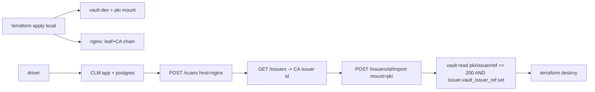

# Design: Terraform-provisioned Vault integration validation — (#25 follow-up)

- **Depends on:** #25 mode B (`POST /issuers/{id}/import` → `pki/issuers/import/bundle`) — shipped.
- **Status:** Design gate — awaiting approval before implementation.
- **Goal:** Validate the CA-import + reconcile flow end-to-end against a **real** Vault, provisioned entirely by Terraform, in two scenarios.

## Scenarios (per approved decisions)

| # | Vault | Provisioning | Secrets | CI |
|---|-------|--------------|---------|----|
| 1 | Local Vault **dev mode** in Docker | `kreuzwerker/docker` + `hashicorp/vault` (+ `hashicorp/tls`) | none | **runs in CI** |
| 2 | **Existing** HCP Vault cluster | `hashicorp/hcp` + `hashicorp/vault` | HCP creds via env / gitignored tfvars | opt-in, not CI |

## File layout

```text
test/integration/
  terraform/
    local/            # scenario 1 — self-contained, no secrets
      main.tf         # docker network, vault dev container, tls CA+leaf, nginx container, PKI mount
      variables.tf
      outputs.tf      # vault_addr, vault_token, target_host, ca_subject
    hcp/              # scenario 2 — opt-in
      main.tf         # hcp + vault providers; enable/configure PKI on existing cluster
      variables.tf    # vault_addr, vault_namespace (admin), vault_token, hcp_* (from env)
      outputs.tf
      terraform.tfvars.example
  run-integration.sh  # scenario 1 driver: tf apply -> app -> assert -> tf destroy
  integration_test.go # //go:build integration — Go driver for scenario 1 (CI)
  README.md
.github/workflows/ci.yml  # add integration job (scenario 1)
.gitignore                # test/integration/**/.terraform*, *.tfstate*, terraform.tfvars
```

## Scenario 1 — cert topology (self-contained)

To exercise **mode B (CA import)** we need a discoverable **CA issuer** on the wire:

1. `hashicorp/tls` generates a **self-signed root CA** (`is_ca_certificate=true`) and a **leaf** signed by it.
2. An **nginx** container serves `leaf + CA` as the chain on :443. CLM's scan discovers the leaf **and** the CA issuer (from the presented chain → `issuers` table, `is_ca=true`).
3. A **Vault dev** container runs with a `pki` mount enabled (empty — no CA yet).

## Scenario 1 — flow & assertions (driver)



- **Primary assertion (mode B):** after import, the CLM issuer row has
  `vault_pki_mount`/`vault_issuer_ref` set, **and** the CA is readable in Vault
  (`GET {mount}/issuer/{ref}` 200). This is the "import + import button" test.
- Negative check: importing a **non-CA** leaf issuer → 409 (already unit-tested;
  optionally re-asserted here).
- **Note:** reconcile marking the *leaf* `managed_in_vault` is **not** expected —
  reconcile lists Vault-**issued** certs (`pki/certs`), and an imported CA does
  not make the externally-issued leaf appear there. So scenario 1 asserts the
  import result, not a leaf reconcile match. (A leaf-reconcile test would require
  Vault to *issue* the served cert — out of scope here.)

## App + Postgres

Reuse the existing `deploy/` app image + a Postgres container. Options:
- Bring app+db up with Terraform `docker` provider too (fully TF-provisioned), **or**
- Reuse `test/uat` compose for app+db and let Terraform own only Vault+nginx.

**Chosen:** Terraform `local/` provisions **everything** (network, postgres, migrate,
app, vault, nginx) via the `docker` provider, so "setup done by Terraform" holds
and the harness is one `terraform apply`. The app image is built by CI (or a
pre-built tag); TF `docker_image` references it.

## Scenario 2 — HCP (opt-in)

- `vault` provider: `address = var.vault_addr`, `namespace = "admin"`,
  `token = var.vault_token` (from `hcpvenv` / env). `hcp` provider reads
  `HCP_CLIENT_ID/SECRET/PROJECT_ID` from env.
- Terraform **configures PKI on the existing cluster** (enable `pki-clm-int` mount,
  a read-write policy) — does **not** create a cluster.
- Same driver assertions, pointed at the HCP address + `admin` namespace.
- Credentials never committed: `terraform.tfvars` gitignored; `.example` documents keys.

## CI

Add an `integration` job to `.github/workflows/ci.yml` that runs scenario 1
(`sh test/integration/run-integration.sh`) with Docker + Terraform available.
Build-tagged Go driver `//go:build integration` excluded from default `go test ./...`.

## Security

- No secrets committed; HCP creds via env/gitignored tfvars; `.gitignore` covers
  `.terraform*`, `*.tfstate*`, `terraform.tfvars`.
- Local Vault is dev mode (root token, ephemeral) — local-only, documented.
- Vault import uses the read-write PKI policy from the #25 spec.

## Verification gate

`terraform -chdir=test/integration/terraform/local validate`, `terraform fmt -check`,
`go vet`/`go build` (integration tag compiles), `sh test/integration/run-integration.sh`
locally, then PR + sub-agent review.
