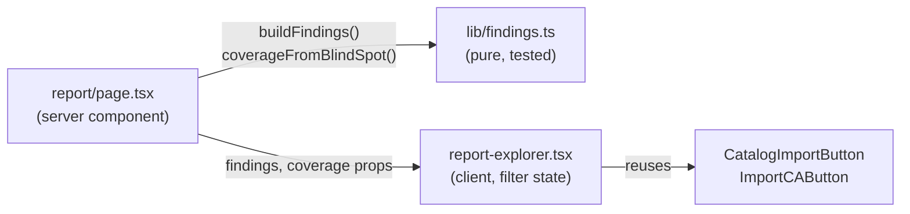

# Environment Report Redesign (Vault Radar style) — Design Spec

- **Issue:** #73
- **Date:** 2026-07-09
- **Status:** Approved (design), pending spec review
- **Type:** Web UI redesign (no API / data-model / scan-policy change)
- **Phase:** 1 of 3 toward the "whole inventory experience" (phases 2–3 = blind-spot
  card + inventory table, separate issues).

## Goal

Rebuild `/scans/{id}/report` to look product-ready, closely aligned with the
HashiCorp Vault Radar report: a **summary → filterable findings list → detail
drill-in** hierarchy, replacing the current four flat stacked panels. Establish
the shared visual language (severity badges, coverage meter, findings table) that
phases 2–3 will reuse.

## Problem

The report page today (`web/app/scans/[id]/report/page.tsx`, shipped in #68) is
four independent `panel` sections: a 4-tile Summary, an Insights table, a
shadow-cert table, and a CA-issuer table. There is no severity overview, no
filtering, no risk emphasis, no visual hierarchy — it reads as a prototype.

## Design

### Three units with clear boundaries



**1. `web/lib/findings.ts` — pure normalizer (no React, no I/O).**
Folds the three existing data sources into one list, each row tagged by `kind`.

```ts
type FindingSeverity = "critical" | "high" | "medium" | "low" | "info";
type FindingKind = "insight" | "shadow" | "issuer";
type Finding = {
  key: string;            // stable React key
  kind: FindingKind;
  severity: FindingSeverity;
  typeLabel: string;      // e.g. "Shadow certificate", "Expiry critical"
  subject: string;        // subject_cn / issuer DN
  secondary: string;      // serial / category / issuer DN
  vault: "shadow" | "managed" | "na";
  days: number | null;    // days_until_expiry (null for insights)
  description?: string;
  issuerDn?: string;
  fingerprint?: string;
  serial?: string;
  cert?: Certificate;     // present for kind="shadow" → enables Track-in-CLM
  issuer?: Issuer;        // present for kind="issuer" → enables Import-CA
};
```

Exports: `buildFindings(report, certs, issuers)`, `deriveShadowSeverity(cert)`,
`deriveIssuerSeverity(issuer)`, `severityCounts(findings)`,
`coverageFromBlindSpot(blindSpot)`, `findingSeverityBadgeClass(sev)`.

`buildFindings` concatenates, using the existing `selectShadowCerts` /
`selectScanIssuers` from `web/lib/report.ts`:
- insights → `severity` taken from the backend `ReportInsight.severity`.
- shadow certs (`selectShadowCerts`) → `severity` derived (rubric below); `cert`
  attached for the action.
- scan CA issuers (`selectScanIssuers`) → `severity` derived; `issuer` attached.

**2. `web/components/report-explorer.tsx` — client component.**
Owns three pieces of filter state: `severities: Set<FindingSeverity>`,
`kind: string`, `query: string`. Renders, top to bottom:
- **Severity overview**: 5 count cards (Critical…Info; clicking a card toggles that
  severity filter) + a **Vault-coverage** card (percentage + meter + "N managed / M
  shadow of K on the wire").
- **Toolbar**: title with live count, search box, severity filter chips, and a
  **kind segment** (All / Shadow certs / Insights / CA issuers).
- **Findings table**: columns Severity (badge) · Finding · Subject (+ secondary) ·
  Vault status · Days left · caret. Each row has a left severity stripe. Clicking a
  row (or Enter/Space) toggles an inline **detail** row.
- **Detail drill-in**: description + a key/value grid (issuer, serial, fingerprint,
  last-seen, scope) + actions: `CatalogImportButton` (when `cert`), `ImportCAButton`
  (when `issuer`), and a "View certificate" link (when `cert`).
- **Empty state** when filters match nothing.

Presentational sub-components (`SeverityOverview`, `FindingRow`, `Kv`) live in the
same file.

**3. `web/app/scans/[id]/report/page.tsx` — thin server component.**
Keeps the existing `Promise.all([fetchReport, listScanCertificates, listIssuers])`,
computes `const findings = buildFindings(report, certs, issuers)` and
`const coverage = coverageFromBlindSpot(report.blind_spot)`, and renders
`<ReportExplorer findings={findings} coverage={coverage} />` in place of the four
panels. Retains `PageHeader` + `ReportDownloadMenu` and the Recommended-actions
panel. The not-completed-scan placeholder branch is unchanged.

Styling: additive classes appended to `web/app/globals.css`, all colors via
existing HDS `--token-color-*` tokens (a few literal hex values for the "high"
severity, which HDS has no dedicated token for).

### Severity rubric (v1 — thresholds hard-coded; see Future work)

- **Shadow cert:** `status="expired"` or `days < 0` → **critical**; `days ≤ 7` →
  **critical**; `days ≤ 30` → **high**; else → **medium** (unmanaged floor).
- **CA issuer:** `days ≤ 30` → **high**; else → **low**.
- **Insight:** use the backend `severity` unchanged.

### Data flow

Server fetches report + scan certs + issuers → `buildFindings` normalizes →
`ReportExplorer` receives immutable `findings` + `coverage` → filtering is
client-side derived state (no refetch). Row actions call the existing API clients
and `router.refresh()` (unchanged behavior).

### Error handling

- Report arrays already default defensively (`report.insights ?? []`); the
  normalizer tolerates empty inputs and returns `[]`.
- `coverageFromBlindSpot` returns `pct: 0` when `discovered === 0` (no divide-by-zero).
- Not-completed scan → existing placeholder panel (untouched).

## Testing (test-first)

- **`web/lib/findings.test.ts`** — `deriveShadowSeverity` (expired/≤7/≤30/else),
  `deriveIssuerSeverity`, `buildFindings` (folds 3 kinds, excludes managed certs,
  attaches cert/issuer, unique keys), `severityCounts` (includes zeros),
  `coverageFromBlindSpot` (percentage + zero-discovered).
- **`web/components/report-explorer.test.tsx`** — renders coverage + every row;
  severity chip filters; search filters; row drill-in reveals detail + action;
  empty state. Follows the repo RTL convention (`vi.mock("@/lib/api", …)`,
  `render`/`screen`, `userEvent`).

## Docs

- `require-docs.mdc`: this is UI-only (no API / scan-policy / deployment /
  data-model change), so README/architecture/data-model updates are **not**
  triggered. The README's feature list already covers the report page.
- Update `progress.md` (move the redesign item from "next" to done on merge).

## Verification

`npx tsc --noEmit`, `npm test`, `cd web && npm run build`; subagent code review on
the branch diff; manual dashboard check on a completed scan (overview counts,
coverage meter, severity + kind filters, search, drill-in, Track-in-CLM /
Import-CA actions).

## Acceptance criteria

(Mirrors issue #73.)

- [ ] Severity overview (5 counts) + Vault-coverage meter from `report.blind_spot`.
- [ ] One findings table replaces the Summary/Insights/shadow/CA panels; all three
  sources folded; per-kind actions preserved.
- [ ] Filter by severity (multi-select) and kind (All/Shadow/Insights/CA); search
  over subject/secondary.
- [ ] Row drill-in with source context; existing import actions still work.
- [ ] `PageHeader` + Download menu + Recommended-actions retained.
- [ ] Normalizer logic in a tested `web/lib/findings.ts`.
- [ ] Light theme only; no behavior/API/data-model change; typecheck/tests/build pass.

## Out of scope

- Blind-spot card and inventory-table restyle (phases 2 & 3).
- IP:port endpoint column (needs an `Observation` join; not on `Certificate`).
- Dedup between an insight and the shadow cert it may describe (matches today's
  report, which shows both).
- Adding a per-row "Renew via AAP" action (behavior addition — possible follow-up).

## Future work (follow-up TODOs)

- **Configurable severity baseline** (user request): the rubric thresholds above are
  hard-coded for v1. A later change should make the shadow/issuer severity
  thresholds configurable (e.g. env/config or per-deployment policy), rather than
  literals in `lib/findings.ts`. File as its own issue.
- Phases 2–3: propagate the shared visual language (badges, coverage meter, table)
  to the blind-spot card and the inventory table.
