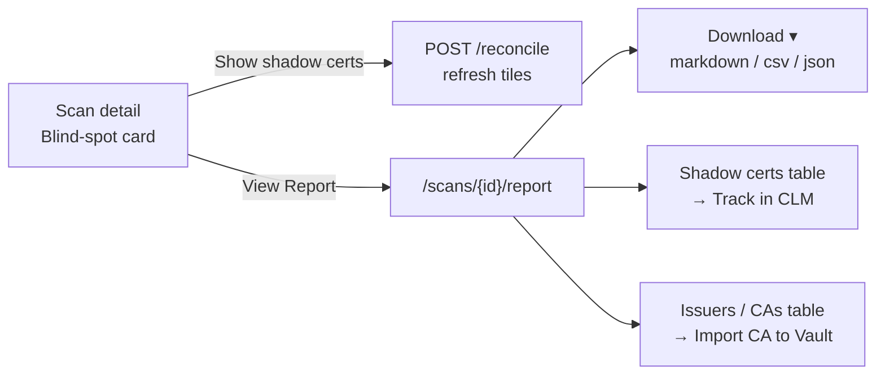

# Report viewer page, in-report actions, and help popovers — design

**Date:** 2026-07-09
**Status:** Approved (brainstorm) — pending spec review
**Area:** `web/` dashboard (Next.js). No backend/Go changes.

## Problem

On the scan detail page (`/scans/{id}`), the **Blind-spot reveal** card exposes two
primary buttons — **Reconcile with Vault** and **Download report** — plus two extra
raw download buttons (CSV, JSON). Testing surfaced three issues:

1. **"Download report" dumps a file** with no way to read the report first. The user
   wants to *view* the report as a styled page, then *download* from there.
2. **"Reconcile with Vault" is ambiguous.** "Reconcile" implies *rectifying* a diff,
   but the action is **read-only**: it compares certs found on the wire against
   Vault-issued certs and recomputes the blind-spot counts (managed / shadow /
   SC-081). It does **not** import anything. Import is a separate action that today
   lives only on the cert-detail and issuers pages. The user wants import surfaced
   in the report, and the button relabeled.
3. **No inline explanation** of what each button does.

## Goals

- Replace file-first download with a **view-first** flow: a **View Report** page that
  renders the report in the dashboard's Vault/Helios design system, with **Download**
  available *from that page*.
- **Relabel** "Reconcile with Vault" → **"Show shadow certs"** (same read-only
  action) and explain it via a help popover.
- Surface **import actions inside the report**: **Track in CLM** per shadow cert and
  **Import CA to Vault** per issuer.
- Add a reusable **help popover** (`?` icon, click-to-open) to the blind-spot buttons.

## Non-goals

- No backend/API changes. Every endpoint needed already exists.
- No change to what reconcile *computes* — only its label and help text.
- No new report content in the Go renderers; the page consumes the existing JSON
  report (`report_version` 0.2.0) plus existing cert/issuer list endpoints.

## Existing surfaces reused (no changes)

| Endpoint / client fn | Use |
|----------------------|-----|
| `GET /scans/{id}/report?format=json` | Report body (summary, insights, recommendations, aggregates, diagnostics) |
| `GET /scans/{id}/report?format=markdown\|csv\|json` (`downloadReport`) | Download menu |
| `listScanCertificates(id)` | Shadow-cert action table |
| `listIssuers()` | Issuer CA-import action table |
| `catalogImport(id)` | "Track in CLM" (mode A, `managed_status=imported`) |
| `importIssuer(id, mount)` | "Import CA to Vault" (mode B, Vault write) |
| `triggerReconcile()` / `fetchBlindSpot(id)` | "Show shadow certs" button (unchanged behavior) |

Relevant data fields already present:
- `Certificate.managed_status` — `managed_in_vault` (Vault-issued), `imported`
  (tracked in CLM), otherwise a **shadow** cert.
- `Issuer.is_ca`, `Issuer.issuer_dn`, `Issuer.vault_issuer_ref`,
  `Issuer.vault_pki_mount`.

## Design

### Flow



### 1. `HelpPopover` component (`web/components/help-popover.tsx`)

Reusable inline help affordance.

- Renders a small `?` button (`aria-label`, `aria-expanded`, `aria-controls`).
- Click toggles a popover panel holding `children` (short text, optional link).
- Closes on **Escape** and on **outside click**; focus returns to the trigger.
- Purely presentational; no data deps. One clear purpose: show contextual help.

Usage:

```tsx
<HelpPopover label="What does this do?">
  Compares certificates found on the wire against Vault-issued certs to reveal
  shadow certs. Read-only — it changes nothing in Vault and imports nothing.
</HelpPopover>
```

### 2. `BlindSpotCard` changes (`web/components/blind-spot-card.tsx`)

- **Button rename:** "Reconcile with Vault" → **"Show shadow certs"** (busy label
  "Checking…"). Behavior unchanged: `triggerReconcile()` then refresh tiles.
  Followed by a `HelpPopover` explaining it is a read-only reveal.
- **Downloads removed from the card:** delete the three `Download report` /
  `Download CSV` / `Download JSON` buttons. Replace with a single **View Report**
  link to `/scans/{id}/report` (styled as `button button-secondary`), with its own
  `HelpPopover` ("Opens the full environment report; download from there").
- `handleDownload` and the `downloading` state move out of the card (into the report
  page). Reconcile/summary logic stays.

### 3. Report page (`web/app/scans/[id]/report/page.tsx`)

Server component that fetches in parallel: the JSON report, the scan's certificates,
and the issuer list. Renders panels in the existing design system:

1. **Header** — `PageHeader` with scan id, generated-at, breadcrumb back to the scan;
   actions slot holds the **Download ▾** menu (client component).
2. **Summary tiles** — Vault managed / On wire / Shadow / SC-081 (from report
   `blind_spot`).
3. **Insights & recommendations** — from report `insights` / `recommendations`
   (severity badge + text).
4. **Aggregates** — cert health, expiry risk, issuer trust, scope/governance
   (compact tables/lists from the report doc).
5. **Take action — Shadow certificates** (client component `ShadowCertActions`):
   scan certs with `managed_status !== 'managed_in_vault'`. Columns: CN/SAN, expiry,
   status; action **Track in CLM** (`catalogImport`). Rows already `imported` show a
   "Tracked" badge. Optimistic per-row state + error line; no full-page reload.
6. **Take action — Issuers / CAs** (client component `IssuerActions`): issuers whose
   `issuer_dn` appears among the scan's certs and `is_ca`. Action **Import CA to
   Vault** (`importIssuer`), reusing the existing consent flow/mount input pattern
   from the issuers page. Issuers with `vault_issuer_ref` show an "In Vault" badge.
   If no such issuers, the section renders an empty-state note.

**Download menu** (`web/components/report-download-menu.tsx`, client): a `Download ▾`
button revealing Markdown / CSV / JSON, each calling `downloadReport(scanId, fmt)`.
Reuses the current fetch-and-save logic lifted from `BlindSpotCard`.

Guard: if `scan.status !== "completed"`, the page shows the same "complete the scan"
message the card uses today (report unavailable).

### Shadow-cert / issuer matching rules

- **Shadow cert:** `managed_status !== 'managed_in_vault'`. (`imported` certs are
  still shadow from Vault's perspective but already tracked — show "Tracked", disable
  the action.)
- **Scan issuers:** build the set of `issuer_dn` from the scan's certs; show issuers
  from `listIssuers()` whose `issuer_dn` is in that set and `is_ca === true`.

## Error handling

- Report fetch failure → page-level error panel with a retry link back to the scan.
- Per-row import failure (Track in CLM / Import CA) → inline error next to the row;
  other rows unaffected. Success flips the row to its "done" badge.
- Vault-not-configured on CA import → surface the API's 503 message inline (mirrors
  existing issuers-page behavior).

## Testing

- `cd web && npm run build` (type-check + build) must pass.
- `go build ./...` unaffected (no backend change) — run as a sanity check.
- **Manual verification** (per `verify` skill): complete a scan, open the report
  page, confirm summary/insights render, Download ▾ saves each format, "Track in CLM"
  flips a shadow row to "Tracked", "Import CA to Vault" reflects Vault state.
- Add a component test **only if** the web app already has a test runner configured
  (confirm during planning); otherwise rely on build + manual verify.

## Rollout / files

New:

- `web/app/scans/[id]/report/page.tsx`
- `web/components/help-popover.tsx`
- `web/components/report-download-menu.tsx`
- `web/components/shadow-cert-actions.tsx`
- `web/components/issuer-actions.tsx`

Changed:

- `web/components/blind-spot-card.tsx` (relabel, remove downloads, add View Report +
  help popovers)
- `web/lib/api.ts` (add `fetchReport(scanId)` returning the parsed JSON report if a
  typed accessor doesn't already exist)

Docs:

- Update `README.md` dashboard section to describe the report page (view-first +
  in-report import) after implementation.
