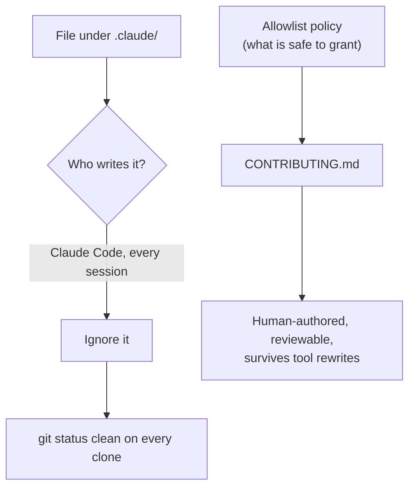

# Claude Code settings: ignore the tool-owned directory — Design Spec

- **Issue:** #76
- **Date:** 2026-07-28
- **Status:** Approved (design revised after code review — see [Revision](#revision-after-code-review))
- **Type:** Repo configuration (no API / data-model / scan-policy / UI change)

## Goal

Make `git status` clean at the end of an agent-assisted session, on any clone,
without committing anything unsafe or anything the tool will immediately rewrite.

## Problem

`.claude/` is untracked, so every agent session ends with `?? .claude/` and trips
the repo's Rule 2 Stop hook (never leave the working tree dirty). A warning that
fires every single session is background noise, not a signal — the failure mode
that trains people to stop reading warnings.

## Design

**Ignore `.claude/` in full. Keep the allowlist policy in `CONTRIBUTING.md`.**

Claude Code owns the files in `.claude/` and rewrites them continuously:
approvals granted during a session are appended to `settings.json`
automatically, along with keys like `additionalDirectories` that contain
absolute machine paths. It is a tool-managed cache, not a human-authored
config file.



The shared knowledge worth keeping is not the file's bytes — it is the judgment
about *which permissions are safe to grant*. That belongs in prose a human
maintains and a reviewer reads, so `CONTRIBUTING.md` gains a section covering
the never-allowlist entries and the generalize-vs-one-off distinction.

Directory-level `.claude/` is the correct ignore form here precisely because
nothing inside is re-included. (Had we needed to track one file, git's rule that
it never descends into an excluded directory would have forced the
`.claude/*` + `!.claude/settings.json` contents-glob form instead.)

## Revision after code review

The original design tracked a pruned `.claude/settings.json` as a
"project-shared" allowlist and ignored only `.claude/settings.local.json`. A
sub-agent review refuted it on four verified points, each reproduced
independently before acting:

**1. The premise was empirically false.** The tracked file re-dirtied *during
the review itself* — `A` → `AM` — gaining six one-off entries plus an
`additionalDirectories` key holding `/Users/djoo/...`. Two of this spec's own
acceptance criteria ("status clean", "no machine-specific paths") failed while
the review was still running. Tracking would have converted an inert `?? .claude/`
into a `M .claude/settings.json` that mutates every session — worse, because it
gets swept into unrelated `git commit -a` runs and conflicts between contributors.

**2. A retained entry granted host root.** The pruned file kept
`Bash(podman machine *)`. Verified live:

```text
podman machine ssh 'sudo -n id -u'        → 0                    (passwordless root)
podman machine ssh 'test -w /Users/djoo'  → writable             (host home, RW)
```

`podman machine ssh <cmd>` runs arbitrary commands as root in a VM that
bind-mounts the host home read-write — unattended read/write on `~/.ssh` and
every repo on the machine. The first draft dropped `Bash(python3 -c ' *)` for
being an arbitrary-execution risk while retaining something strictly worse.
`Bash(podman compose *)` (arbitrary host mounts via `compose run -v`, plus
`down -v` destroying `pgdata`) and `Bash(podman exec *)` were lesser instances
of the same error.

**3. The ignore rule leaked on a fresh clone.** Ignoring only
`settings.local.json` left `.claude/` live, so any *other* file the tool writes
there dirties the tree. It appeared to work locally only because
`.git/info/exclude` carries nine `**/.claude/...` patterns — and that file is
per-clone and never committed. A teammate would have reproduced #76 immediately.

**4. The shared file was not shared knowledge.** Every entry was a `podman`
command, but `git grep -i podman` returns zero hits in tracked files outside the
changeset; the repo documents `docker compose` throughout (Makefile, README,
CONTRIBUTING, CI rules). The "project-shared" allowlist was one contributor's
runtime substitution — the same category the change set out to prune.

The review also corrected the stated rationale for pruning: allowlist patterns
are **prefix** matches, not exact-string matches, and fixed entries do recur
(the repo's own `curl` verification commands run every cycle). The real argument
against one-off entries is that they encode incidental history and leak local
paths. `CONTRIBUTING.md` now says that.

## Security review

The change tracks no permission grants at all, so it confers nothing. Its
security value is negative-space: the never-allowlist table in `CONTRIBUTING.md`
records *why* `podman machine *`, `compose *`, `exec *`, and `python3 -c` are
unsafe, so the next contributor does not re-add them.

## Acceptance criteria

- [ ] `.claude/` ignored in full; `git status --porcelain` empty after a session
- [ ] no `.claude/` file tracked (`git ls-files .claude/` empty)
- [ ] holds on a fresh clone, with no dependence on `.git/info/exclude`
- [ ] interim `.git/info/exclude` entry reverted
- [ ] `CONTRIBUTING.md` documents the never-allowlist set and the reasoning

## Test plan

No runtime behaviour changes: no Go, TypeScript, SQL, or container source is
touched. Verification proves absence of regression, plus the config invariants.

| Check | Command | Expected |
|-------|---------|----------|
| Go tests | `go test ./...` | pass |
| Go build | `go build ./...` | pass |
| Web tests | `cd web && npm test` | pass |
| Web build | `cd web && npm run build` | pass |
| Compose smoke | `/api/v1/health`, `:3000/` | 200, 200 |
| Tree clean | `git status --porcelain` | empty |
| Nothing tracked | `git ls-files .claude/` | empty |
| Ignore works | `git check-ignore .claude/settings.json` | match |
| Fresh-clone safe | `git check-ignore` a novel `.claude/` path | match |

`.cursor/rules/require-tests.mdc` scopes tests to Go behaviour changes and
states docs-only changes do not require them, so no unit test is owed. A test
asserting the contents of an ignored file would assert nothing.
