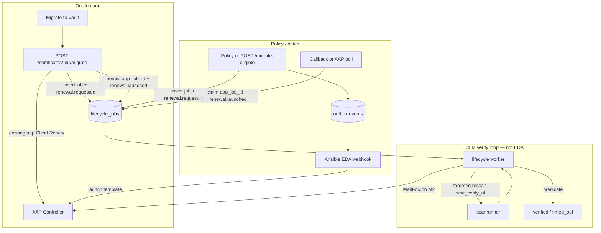

# Migrate to Vault — Mode C + pending verify — design

**Status:** Draft  
**Date:** 2026-08-13  
**Parent:** [M2 durable lifecycle jobs](2026-08-13-m2-durable-lifecycle-jobs-design.md) ([#80](https://github.com/glimpsovstar/hashicorp-vault-clm-discovery/issues/80)), umbrella [#78](https://github.com/glimpsovstar/hashicorp-vault-clm-discovery/issues/78)  
**Plan:** [2026-08-13-migrate-pending-verify.md](../plans/2026-08-13-migrate-pending-verify.md)  
**Issue draft:** [migrate-pending-verify.md](../issues/migrate-pending-verify.md)  
**Depends on:** M2 `lifecycle_jobs` (ship on top of M2; do not re-specify the job table)  
**Modes:** [Vault import workflow](2026-07-06-vault-import-workflow-design.md) A/B/C/D · [ADR 0001](../../adr/0001-source-of-truth-and-event-driven-automation.md)

This **extends** M2. It does not replace persist-before-202, `WaitForJob` in a worker, or the expected-vs-observed predicate.

---

## Problem

Operators see a leaf on the wire (TLS scan today; ADCS / Azure Key Vault collectors later) and want it “in Vault.” The tempting action is **upload the PEM into Vault PKI** (`pki/issue` or treat the leaf as issuable material).

That cannot work:

1. **CLM has no private key.** Discovery stores the public certificate (+ metadata) only ([ADR 0001](../../adr/0001-source-of-truth-and-event-driven-automation.md)). A scanned ADCS/AKV/TLS leaf is not an issuable Vault cert.
2. **Vault `pki/issue` creates a new leaf** from a role + CSR/key. It does not ingest a foreign leaf PEM and start issuing with that identity.
3. **Mode B** (`pki/issuers/import/bundle`) is for **CA** material only. Posting a leaf there is the wrong API and the wrong trust object.
4. **Mode A** (`catalog-import`) only tracks the row in CLM (`managed_status=imported`). It does not make Vault the issuer.

So “Import to Vault” for a **leaf** is not upload. It is **Mode C migrate**: Vault issues a **new** cert (CSR-on-target / AAP), AAP deploys it, CLM independently verifies the **wire**. The old cert is **replaced**, not uploaded.

AAP `successful` is still not “new cert on the wire” (M2). After launch, the operator needs a durable **Pending** state while CLM rescans the target host on a backoff until the successor is observed — or the job **times out**.

EDA must not own that loop. EDA launches AAP from webhooks; **CLM owns verify**.

## Goal

Give operators a **Migrate to Vault** path for unmanaged / catalog-tracked **leaves** that:

1. Rejects any “upload PEM into `pki/issue`” interpretation (no such endpoint; copy never says Upload).
2. Reuses M2 `lifecycle_jobs` + the existing AAP renew client (CSR-on-target / AAP only).
3. Supports **dual kickoff**: on-demand CLM→AAP, and policy/batch CLM→outbox→EDA webhook→AAP.
4. Shows user-facing **Pending** (`pending_verify`) until the M2 verify predicate passes or a configurable timeout fires.
5. Emits `renewal.requested` / `renewal.launched` / `renewal.verified` / `renewal.timed_out` (ADR catalogue, Phase 1 webhook only).

Private keys never enter CLM. No SSH/k8s deployers. No message bus.

## Relationship to existing modes

| Mode | What it does | This spec |
|------|----------------|-----------|
| **A** Catalog | Track in CLM, no Vault write | Unchanged. Often the step *before* migrate. |
| **B** CA import | `pki/issuers/import/bundle` | Unchanged. **CAs only.** Leaves must not use this. |
| **C** Reissue + deploy | Vault issue + AAP + rescan | **This spec implements the migrate + verify loop.** |
| **D** Mirror | Wire vs Vault panel | Unchanged. After verify + reconcile, successor shows `managed_in_vault`. |

`POST /certificates/{id}/renew` remains the on-demand path for certs that already have `renewal_config` / are Vault-managed. **Migrate** is the same actuation (AAP renew client) with `job_kind=migrate`, aimed at shadow / ADCS / AKV / TLS leaves that Vault did not issue.

## Locked decisions (2026-08-13 brainstorming)

- You **cannot** upload a scanned leaf into Vault as an issuable cert (no private key). Reject “import PEM into `pki/issue`.”
- “Import to Vault” for ADCS/AKV/TLS leaves = **Mode C migrate**: Vault issues a **new** cert (CSR-on-target / AAP); CLM independently verifies the wire; old cert is replaced, not uploaded.
- Mode A and Mode B already exist; this spec is the migrate path + verify loop only.
- **Dual kickoff (both):**
  - On-demand: UI/API **Migrate to Vault** → CLM launches AAP (existing renew client).
  - Policy/batch: CLM emits outbox event → EDA webhook → AAP. CLM records/claims the job when `aap_job_id` appears (callback or poll).
- **CLM owns the verify loop**, not EDA. EDA does not rescan.
- User-facing status **Pending** (`pending_verify`) after AAP success (or immediately after launch until first success check).
- Scheduled rescans of the **target host** with backoff until success or **timeout** (default **24h**, configurable).
- Success predicate is **M2’s**: same CN, **new** `fingerprint_sha256`, later `not_after`; predecessor no longer served. AAP successful ≠ verified.
- No message bus (ADR Phase 2). Webhook only.
- No SSH/k8s deployers in CLM. AAP only.
- Private keys never in CLM.
- Implement as an extension of `lifecycle_jobs` (M2). If M2 is not merged, **ship on top of M2** — do not re-specify the whole job table here.
- Events: `renewal.requested` / `renewal.launched` / `renewal.verified` / `renewal.timed_out`.

## State machine

M2 already maps AAP Controller status onto CLM job status. This spec **adds** `pending_verify` and `timed_out` and makes Pending the operator-visible state during the verify loop.

```
create → [pending_approval] → launching
      → aap_pending | aap_running | aap_successful
      → pending_verify  ← user-facing "Pending"
            ↻ targeted rescan on backoff (next_verify_at)
            → verified
            → timed_out
      → aap_failed | error | canceled → failed
```

Do not invent AAP-equivalent states. Worker still uses `internal/aap` only.

### Status mapping

| Internal (`lifecycle_jobs.status`) | User-facing | Meaning |
|------------------------------------|-------------|---------|
| `pending_approval`, `launching`, `aap_pending`, `aap_running`, `aap_successful`, **`pending_verify`** | **Pending** | Job exists; wire not yet proven. |
| `verified` | Verified | M2 predicate passed. |
| `timed_out` | Timed out | Deadline hit without a matching successor on the wire. |
| `failed` | Failed | AAP failed / canceled / error (M2). Not a verify timeout. |

Enter **`pending_verify` immediately after launch** (or as soon as the job row exists) so the UI can show Pending before the first AAP success poll. Keep M2 AAP statuses for the worker/timeline; the dashboard badge is still **Pending** until `verified` / `timed_out` / `failed`.

After AAP reaches `successful`, remain in `pending_verify` and continue the backoff. **Do not** mark `verified` on AAP success.

`verify_failed` from the M2 sketch is **not** a terminal state here. A failed probe is a miss: bump `verify_attempt`, set `next_verify_at`, stay `pending_verify` until timeout.

### Timeout clock

- `timeout_at = created_at + LIFECYCLE_VERIFY_TIMEOUT` (default **24h**).
- Clock starts at **job create** (covers “Pending after launch”).
- When `now >= timeout_at` and the predicate has not passed: `timed_out`, emit `renewal.timed_out`. Stop scheduling.
- AAP `failed` before timeout: `failed` (M2), not `timed_out`.

## Dual kickoff

Both paths write a `lifecycle_jobs` row with `job_kind=migrate` (or `renew` when the existing renew endpoints are used). One verify worker. Two entry points — same as ADR 0001’s “one launch service, two triggers,” plus an EDA-launched variant that does **not** call Controller from the HTTP handler.



### Path 1 — On-demand (CLM launches AAP)

1. Operator clicks **Migrate to Vault** (consent modal).
2. `POST /api/v1/certificates/{id}/migrate` with `consent: true` and Vault PKI coordinates (same fields as `/renew`).
3. Handler inserts `lifecycle_jobs` **before** 202 (M2 rule), `job_kind=migrate`, `status=pending_verify` (or `launching` then immediately `pending_verify`), `timeout_at`, `next_verify_at = now + 10s`.
4. Same transaction: persist `renewal_config` (M2 already requires this on `/renew`), emit **`renewal.requested`**.
5. Call existing `launchRenewal` / `aap.Client.Renew`. Persist `aap_job_id`, emit **`renewal.launched`**.
6. Return **202** with `lifecycle_job_id`. No `WaitForJob` on `r.Context()`.

Idempotency: same key as M2 (`certificate_id` + `job_kind` + open job). A second click returns the existing job, does not double-launch.

### Path 2 — Policy / batch (EDA launches AAP)

1. Operator or scheduler calls `POST /api/v1/migrate-eligible` (consent-gated), **or** a policy worker selects eligible leaves and inserts jobs.
2. CLM **does not** call Controller. It inserts jobs (`aap_job_id` null), emits **`renewal.requested`** in the same transaction.
3. Outbox dispatcher POSTs to the EDA webhook (ADR Phase 1). EDA rulebook launches the existing renew job template with extra_vars from the event payload (`idempotency_key` included).
4. CLM **claims** the job when `aap_job_id` appears:
   - **Callback (primary):** `POST /api/v1/lifecycle-jobs/claim` with `{ "idempotency_key", "aap_job_id" }` (machine token / same API auth as M1). Sets `aap_job_id`, emits **`renewal.launched`**.
   - **Poll (fallback):** worker lists/finds AAP jobs whose extra_vars contain the idempotency key (or CN + mount + role + created-after). First match wins; never double-claim.
5. Verify loop is identical to path 1.

EDA **must not** trigger a CLM rescan and **must not** mark verified.

## Verify schedule

CLM schedules **targeted rescans of the predecessor’s last observation** (hostname/IP + port from `certificate_observations`, else `renewal_config.target_hosts` if it is a resolvable host — not an Ansible group name). Same M2 stopgap: `CreateScan` + `scanrunner.Run` until M4.

Backoff after job create / first `pending_verify` (delays until the **next** attempt):

| Attempt | Delay |
|---------|--------|
| 1 | 10s |
| 2 | 30s |
| 3 | 60s |
| 4 | 5m |
| 5 | 30m |
| 6 | 60m |
| 7 | 3h |
| 8+ | 6h (cap) |

Hardcode this table in `internal/lifecyclejobs` (or a tiny `verifybackoff` helper). Do not make the steps env-configurable in v1; only the **timeout** is configurable.

- `next_verify_at` is stored on the job. Scheduler claims `status = pending_verify AND next_verify_at <= now AND now < timeout_at`.
- After a miss: `verify_attempt++`, `next_verify_at = now + delay(attempt)`. If that instant is `>= timeout_at`, run one last attempt at `timeout_at` then `timed_out`.
- Probe errors (timeout, TLS fail) count as a miss, not `failed`.
- Success: M2 predicate (below) → `verified`, emit **`renewal.verified`**.

Default timeout: **24 hours**. Env: `LIFECYCLE_VERIFY_TIMEOUT` (Go `time.Duration`, default `24h`). Scheduler tick: `LIFECYCLE_VERIFY_POLL_INTERVAL` (default `5s`).

### Success predicate (from M2 — do not fork)

1. Scan the predecessor’s last observation (or resolved target host).
2. New leaf, **same CN**, **different** `fingerprint_sha256`.
3. `not_after` later than the predecessor.
4. If Vault is configured: successor `managed_in_vault` after reconcile (best-effort in the same verify pass; do not block verified forever on reconcile lag — if fingerprint/CN/`not_after`/predecessor-gone already hold, `verified` is allowed; reconcile can catch up).
5. Predecessor no longer served on that endpoint (or not `last_seen` this scan).

AAP `successful` alone must not mark the job completed or verified.

## Data (delta on M2 only)

M2 owns `lifecycle_jobs`, `job_events`, `approvals`. This feature adds columns (follow-on migration after M2’s, next unused number at implement time):

| Column | Type | Purpose |
|--------|------|---------|
| `job_kind` | text | `migrate` \| `renew` |
| `next_verify_at` | timestamptz | When the worker may probe again |
| `timeout_at` | timestamptz | Hard deadline |
| `verify_attempt` | int | Backoff index (0 before first probe) |

Statuses: add `pending_verify`, `timed_out` to the M2 check/enum.

Do not redesign claim leases, idempotency, expected/observed JSONB, or `aap_job_id`.

## API

All mutating routes stay consent-gated. M1 RBAC applies when present (`remediator`+). 503 if AAP is unset on **on-demand** migrate. Policy/batch may still enqueue `renewal.requested` when AAP is unset only if EDA is expected to launch; if `EDA_WEBHOOK_URL` is also empty, return 503.

### `POST /api/v1/certificates/{id}/migrate`

On-demand Mode C migrate. Body (same shape as `/renew`):

```json
{
  "consent": true,
  "mount": "pki",
  "role": "web-server",
  "service": "nginx",
  "target_hosts": "web_group",
  "ttl": "72h",
  "alt_names": "a.example.com"
}
```

- **202** `{ "status": "pending_verify", "lifecycle_job_id": "…", "job": { …AAP ref if launched… }, "timeout_at": "…", "next_verify_at": "…" }`
- **400** missing consent; invalid extra_vars; empty CN; leaf has no observation and no usable scan target
- **409** `is_ca` (use Mode B); already `managed_in_vault` (use `/renew`); active migrate job exists (return existing id in the error body)
- **404** unknown cert
- **503** AAP not configured

Never accepts a PEM body. Never calls Vault `pki/issue` or `issuers/import/bundle`.

### `POST /api/v1/migrate-eligible`

Policy/batch kickoff. Body: `{ "consent": true }` plus optional filter (`"limit": 100`). Selects eligible leaves (see below), inserts one job each, emits `renewal.requested`, returns **202** `{ "jobs": [ { "lifecycle_job_id", "certificate_id", "status": "pending_verify" } ], "enqueued": N }`. Does **not** launch AAP from the handler.

### `POST /api/v1/lifecycle-jobs/claim`

EDA/AAP callback. Body: `{ "idempotency_key": "…", "aap_job_id": 12345 }`. Sets `aap_job_id` if unset, emits `renewal.launched`. Idempotent if the same id is posted twice. **409** if the job already has a **different** `aap_job_id`.

### `GET /api/v1/lifecycle-jobs/{id}` (M2, extended)

Include `job_kind`, `user_status` (`Pending` \| `Verified` \| `Timed out` \| `Failed`), `next_verify_at`, `verify_attempt`, `timeout_at`, `aap_job_id`, expected/observed.

### Explicitly rejected

- `POST …/import-pem`, `POST …/upload`, or any handler that posts a leaf PEM to Vault `pki/issue` or `pki/cert/import`.
- UI or Choose copy that says **Upload** or **Import leaf to Vault**.

### Eligibility (migrate)

- `is_ca = false`
- `managed_status` in `unmanaged`, `imported` (not `managed_in_vault`)
- non-empty `subject_cn`
- at least one observation **or** a hostname/IP we can rescan (last observation preferred)
- no open `lifecycle_jobs` row in Pending for this cert + `migrate`

CAs → 409 pointing at Mode B. Vault-managed leaves → 409 pointing at `/renew`.

## Events (ADR catalogue)

Phase 1 transport: transactional outbox + EDA webhook. **No NATS/Kafka.**

| Type | When | Payload (minimum) |
|------|------|-------------------|
| `renewal.requested` | Job inserted (both kickoff paths), same txn | `lifecycle_job_id`, `job_kind`, `certificate_id`, CN, mount, role, service, target_hosts, `idempotency_key`, `timeout_at` |
| `renewal.launched` | `aap_job_id` persisted (CLM launch or claim) | above + `aap_job_id` |
| `renewal.verified` | M2 predicate passed | predecessor/successor cert ids, fingerprints, `aap_job_id` |
| `renewal.timed_out` | `timeout_at` reached without verify | `lifecycle_job_id`, `verify_attempt`, last observed fingerprint if any |

**ADR alignment:** ADR 0001 currently lists `renewal.launched` / `renewal.completed` / `renewal.failed`. This spec **adds** `renewal.requested`, `renewal.verified`, `renewal.timed_out`. Treat **`renewal.verified` as the success terminal** for migrate (and for M2 verify success when this ships). Keep M2 **`renewal.failed`** for AAP failure. Do **not** emit `renewal.completed` for migrate; document the rename in ADR 0001 / README so M5 does not re-add a duplicate success event.

Never put PEMs, private keys, or AAP/Vault tokens in payloads.

## UI copy

| Surface | Copy |
|---------|------|
| Button | **Migrate to Vault** |
| Not allowed | Upload, Upload to Vault, Import PEM, Import leaf to Vault, Import to `pki/issue` |
| Consent modal title | Migrate to Vault |
| Consent modal body | Vault will **issue a new certificate** for this name (CSR on the target via Ansible). CLM **cannot upload** the scanned certificate — there is no private key. The old leaf is **replaced**, not imported. Status stays **Pending** until CLM sees the new fingerprint on the wire, or the job times out (default 24 hours). |
| Pending badge | **Pending** |
| Pending detail | Next check {relative `next_verify_at`} · Attempt {n} · Times out {relative `timeout_at`} |
| Verified | **Verified** — new certificate on the wire |
| Timed out | **Timed out** — new certificate was not observed before the deadline. AAP may still have succeeded; rescan or retry migrate. |
| Choose CTA (unmanaged/imported **leaf**, chain OK) | **Migrate to Vault** |
| Choose CTA (CA) | unchanged: **Import CA to Vault** |
| Choose CTA (`managed_in_vault`) | unchanged: None (renew remains a separate action) |
| Mode A button | unchanged: **Track in CLM** |
| Renewal kit | stays as operator helper; primary closed-loop action is **Migrate to Vault** / renew |

Show the migrate button on cert detail for eligible leaves (including report explorer inline actions). Hide it for CAs and `managed_in_vault`.

## Config

| Env | Default | Purpose |
|-----|---------|---------|
| `LIFECYCLE_VERIFY_TIMEOUT` | `24h` | `timeout_at - created_at` |
| `LIFECYCLE_VERIFY_POLL_INTERVAL` | `5s` | Worker claim tick |

Backoff table is code, not env.

## Acceptance criteria

- [ ] No endpoint accepts a leaf PEM for Vault `pki/issue` / leaf import. Handler tests assert `/migrate` body has no PEM field and does not call a Vault issuer API.
- [ ] Eligible leaf: **Migrate to Vault** → 202 with `lifecycle_job_id`; row exists before ack; user-facing status **Pending**.
- [ ] CA → 409 with Mode B guidance; `managed_in_vault` → 409 with `/renew` guidance.
- [ ] On-demand path launches AAP via the existing renew client; `renewal.requested` then `renewal.launched` in outbox; no `WaitForJob` on the request context.
- [ ] Policy/batch path inserts jobs + `renewal.requested` without calling Controller; claim sets `aap_job_id` and emits `renewal.launched`.
- [ ] After AAP success, job stays Pending until the M2 predicate passes; AAP success alone is not `verified`.
- [ ] Targeted rescans follow 10s, 30s, 60s, 5m, 30m, 60m, 3h, 6h… ; `next_verify_at` and attempt are on `GET /lifecycle-jobs/{id}` and the UI.
- [ ] Default timeout 24h (configurable); at deadline without match → `timed_out` + `renewal.timed_out`.
- [ ] Predicate: same CN, new `fingerprint_sha256`, later `not_after`, predecessor not served.
- [ ] Restart reclaim: `pending_verify` jobs resume from `next_verify_at` / `aap_job_id`; no double AAP launch.
- [ ] UI copy is **Migrate to Vault** / **Pending**; never Upload.
- [ ] EDA does not rescan. No NATS. No SSH/k8s package. No private keys in DB, logs, extra_vars, or events.
- [ ] `go test ./...` and `go build ./...` pass. Web build for the new button/badge.

## Out of scope

- Replacing or re-specifying M2’s `lifecycle_jobs` / `WaitForJob` / claim leases (this **extends** them).
- Mode A / Mode B behavior changes.
- Implementing ADCS / AKV / ACM collectors (M5). Those leaves use this **same** migrate path once they exist.
- CLM calling Vault `pki/issue` or storing CSRs/keys.
- SSH, WinRM, typed Kubernetes, or cert-manager deployers.
- Message bus (NATS/Kafka) — ADR Phase 2.
- ITSM, revoke-via-AAP, LLM (M5).
- Making EDA responsible for verify or rescan.
- Changing the operational expiry rubric or SC-081 thresholds.

## Test notes

- Table-test backoff delays (including 6h cap and “next would exceed timeout”).
- Table-test verify predicate (reuse/extend M2 cases; do not duplicate a second definition).
- API: migrate 202 persist-before-ack; 409 CA; 409 managed; 400 consent; 503 no AAP; claim idempotency; batch does not call `Renew`.
- Worker: miss → still `pending_verify` + later `next_verify_at`; success → `verified` + `renewal.verified`; clock expiry → `timed_out` + `renewal.timed_out`; AAP failed → `failed` not timed_out.
- UI: button label; Pending + next-check copy; no “Upload” string in the migrate component.

## Open implementation notes (not product questions)

- Next unused migration number is chosen at implement time (after M2’s `lifecycle_jobs` migration).
- Approvals stay M2/M1: auto/consent until actors exist; do not claim SoD-complete.
- If M2 is not merged, land M2 first (or the same PR stack with M2 commits first). This spec is not a substitute job-table design.
